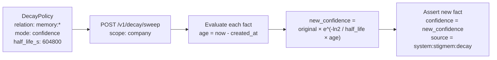

# Decay and Confidence

**Audience:** Node operators and protocol implementers.

## The problem

Knowledge goes stale. An agent's working-context facts from last month are less reliable than today's. A project status asserted three months ago may be irrelevant. Without a freshness signal, downstream agents treat year-old assertions the same as yesterday's — leading to hallucinations grounded in outdated information.

## Naive approaches and why they fail

**Binary TTL (expire after N days).** Simple: after a fixed window, the fact disappears. But knowledge doesn't decay in a step function. A preference expressed last week is slightly less reliable than one expressed today, but it's far more reliable than one expressed a year ago. Binary TTL forces you to pick a cliff edge that's either too aggressive (losing still-valid knowledge) or too permissive (keeping stale noise).

**Manual curation.** Agents or humans periodically review and retract stale facts. This works at small scale but doesn't survive a knowledge base with thousands of entities and dozens of relation types. It also means freshness is only as good as the last curation pass.

**Application-side scoring.** Each consumer applies its own staleness heuristic. This leads to inconsistent behavior: one adapter treats a 30-day-old fact as authoritative while another discards it. The scoring logic is duplicated, untested, and invisible to other consumers.

## Our model

Stigmem separates two orthogonal freshness mechanisms:

| Mechanism | Field | Behavior |
|---|---|---|
| **Hard expiry** | `valid_until` | Binary: fact is invisible after this timestamp (unless `include_expired=true`) |
| **Confidence decay** | `confidence` (via decay sweeper) | Gradual: confidence drops over time according to a half-life function |

Both are enforced at the node level, so every consumer sees consistent freshness without implementing their own logic.

### The confidence field

Every fact carries `confidence` — a float in [0.0, 1.0]:

- **1.0** — Certain. The asserting source is fully confident.
- **0.5** — Uncertain. The source is hedging.
- **0.0** — Retracted. The fact is logically deleted.

Confidence participates in contradiction resolution (higher confidence wins), query filtering (`min_confidence` parameter), and recall ranking (spec §20.3). It is the primary signal that downstream agents use to weight information.

### The decay sweeper

The decay sweeper (spec §15) is a node-level operation that applies operator-configured policies to reduce confidence over time. It is the **remediation complement to lint**: lint identifies stale facts; the sweeper acts on them.



A `DecayPolicy` configures behavior per relation or globally:

```json
{
  "id": "memory-context-decay",
  "relation": "memory:*",
  "scope": "company",
  "mode": "confidence",
  "half_life_s": 604800,
  "min_confidence": 0.1
}
```

This policy says: for all `memory:` relations in `company` scope, halve the confidence every 7 days (604,800 seconds), but never reduce below 0.1. A fact asserted 14 days ago with initial confidence 1.0 would now have `confidence ≈ 0.25`.

### Two decay modes

| Mode | Behavior |
|---|---|
| `retract` | Facts older than `ttl_s` are retracted (`confidence = 0.0`). Binary, like TTL. |
| `confidence` | Exponential half-life decay. Gradual, preserving the fact at reduced weight. |

A third mode, `dry_run`, previews what would change without writing anything.

### Worked example

```bash
# Configure a policy via environment variable
export STIGMEM_DECAY_POLICIES='[
  {
    "id": "stale-roadmap-retract",
    "relation": "roadmap:status",
    "scope": "company",
    "mode": "retract",
    "ttl_s": 2592000
  }
]'

# Run a dry-run sweep to preview
curl -X POST $STIGMEM_URL/v1/decay/sweep \
  -H "Authorization: Bearer $STIGMEM_API_KEY" \
  -d '{"scope": "company", "mode": "dry_run"}'

# → {"dry_run_would_retract": 12, "dry_run_would_reduce": 0, ...}

# Run the actual sweep
curl -X POST $STIGMEM_URL/v1/decay/sweep \
  -d '{"scope": "company"}'

# → {"facts_retracted": 12, "facts_reduced": 0, ...}
```

The sweep is **idempotent** — running it twice produces the same result because the second run sees the retractions from the first.

### Immutability preserved

The decay sweeper does not mutate existing facts. Every decay action is a new immutable assertion:

- **Retraction:** A new fact with `confidence = 0.0` and `source = "system:stigmem:decay"`.
- **Confidence reduction:** A new fact with the computed confidence and the same `source`.

This means you can always distinguish operator-initiated retractions from sweep-generated ones by checking the `source` field.

## Why this is non-obvious

**Gradual decay is more informative than binary expiry.** A fact with `confidence = 0.3` tells a downstream agent "this is old but not retracted — use with caution." A fact that simply vanished after TTL tells the agent nothing — it doesn't know the information ever existed, so it can't even flag uncertainty.

**Decay and `valid_until` coexist.** They serve different purposes. `valid_until` is for facts with a known expiry date ("this API key expires December 31"). Confidence decay is for facts that degrade probabilistically ("Alice prefers dark mode" — probably still true, but less certain as time passes). Both mechanisms apply independently.

**The `stigmem:` namespace is exempt.** System-generated facts (contradiction records, federation metadata) are never decayed. They are protocol accounting, not user knowledge.

## What it costs

- **Write amplification.** Every decay action produces a new fact row. A sweep of 10,000 facts in `confidence` mode produces 10,000 new rows. The decay source marker (`system:stigmem:decay`) makes these identifiable for cleanup.
- **Sweep latency.** The sweeper must read all matching facts, compute their new confidence, and write the results. For scopes under 100,000 facts, this is synchronous (spec guarantees response within 60 seconds). Larger scopes use an async job pattern.
- **Policy tuning.** Choosing the right half-life requires understanding the knowledge domain. Too short and you prematurely degrade valid information; too long and stale facts pollute recall. Start with `dry_run` to preview impact.

## References

- Spec §15 — Decay Semantics (DecayPolicy, sweep wire format, immutability contract)
- Spec §3.2 — `valid_until` and temporal scope
- Spec §3.3 — Confidence in contradiction resolution
- Spec §14 — Lint (stale-fact detection, the diagnostic complement to decay)
- Spec §7 — Design Decisions ("confidence decay over `valid_until` reduction")
