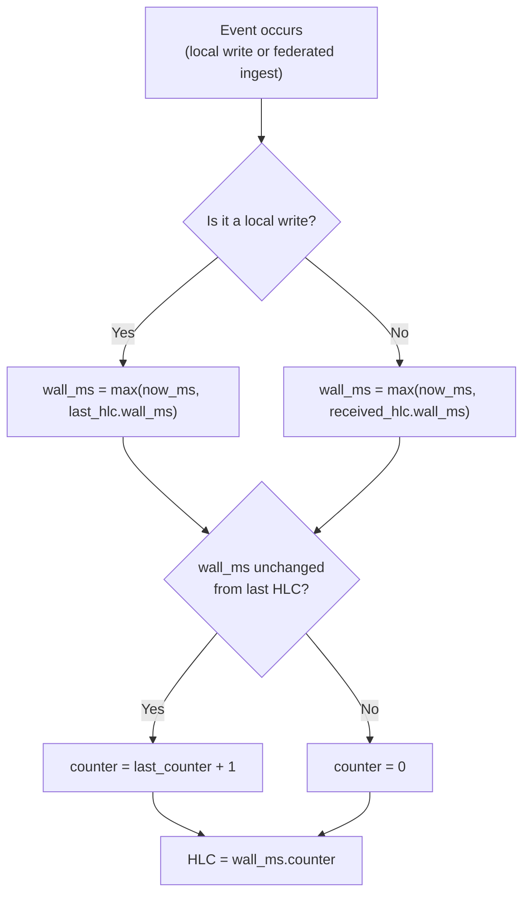

# Hybrid Logical Clocks

**Audience:** Protocol implementers and node operators.

## The problem

Distributed nodes need to agree on the order of events. If Node A asserts "Alice is CEO" and Node B asserts "Alice is CTO" during a network partition, which came first? The answer determines which fact is the latest when the partition heals.

Wall clocks seem like the obvious answer — just compare timestamps. But wall clocks drift. NTP synchronization has millisecond-level jitter, VM clocks can jump, and a node whose clock runs fast will appear to win every conflict. You need a clock that is both causally correct *and* close to real time.

## Naive approaches and why they fail

**Wall clocks alone.** Two nodes with clocks 50ms apart will disagree on ordering for any events within that window. Worse, a clock that jumps backward (e.g., NTP correction) can cause a fact written later to appear older than one written earlier. Last-write-wins systems built on wall clocks are silently lossy.

**Pure logical clocks (Lamport clocks).** A Lamport clock increments on every event and takes the max of local and received clocks on message receipt. This gives correct causal ordering, but the counter is opaque — `event 4,297,831` tells you nothing about *when* it happened. You can't answer "what did the graph look like last Tuesday?" without mapping logical clock values back to wall time, which requires the same drifting wall clocks you were trying to avoid.

**Vector clocks.** Vector clocks track per-node counters and detect concurrent events (not just causal order). But state is O(N) per event where N is the number of nodes. In a federation with hundreds of peers, every fact would carry a vector of hundreds of counters. The overhead is impractical.

## Our model

Stigmem uses a **Hybrid Logical Clock (HLC)**, combining wall-clock time with a logical counter:

```
HLC = "{wall_ms_utc}.{counter}"
```

For example: `"1746230400000.003"` — wall time 1746230400000ms (UTC) with counter 3.

### Advance rules

The HLC advances according to two rules:



**Rule 1 — Local write:** Set `wall_ms = max(now_ms, last_hlc.wall_ms)`. If `wall_ms` is unchanged, increment the counter. Otherwise reset the counter to 0.

**Rule 2 — Federated ingest:** Set `wall_ms = max(now_ms, received_hlc.wall_ms)`. Same counter logic as Rule 1. This ensures the receiving node's clock never goes backward relative to a fact it has just ingested.

### Causal ordering

Two facts `a` and `b` are causally ordered if `a.hlc < b.hlc` (compared as `wall_ms` first, then `counter`). Equal HLCs on different nodes indicate concurrent writes — these are handled by the contradiction policy (spec §3.3).

### Worked example

Consider two nodes during and after a partition:

| Time | Node A (clock accurate) | Node B (clock 20ms ahead) |
|---|---|---|
| T=0 | Asserts fact. HLC: `1000.0` | — |
| T=10 | — | Asserts fact. HLC: `1020.0` (clock is ahead) |
| T=50 | Receives B's fact. `max(1050, 1020)` = `1050`. HLC: `1050.0` | — |
| T=51 | Local write. `max(1051, 1050)` = `1051`. HLC: `1051.0` | — |

Node A's HLC tracks real time closely. When it ingests Node B's fact with `wall_ms = 1020`, it correctly recognizes that its own clock (1050) is ahead and uses that. The counter stays at 0 because `wall_ms` advanced. No causal information is lost, and the ordering is deterministic.

If both nodes had written at the same millisecond, the counter would break the tie:

| Node A | Node B |
|---|---|
| `1000.0` | `1000.0` |
| `1000.1` (second write, same ms) | — |

`1000.1 > 1000.0`, so Node A's second write is ordered after both first writes.

## Why this is non-obvious

**HLC looks like a wall clock, but isn't.** The `wall_ms` component tracks real time closely but is *not* a wall-clock timestamp. It can only advance forward, never backward. This means HLC values are always monotonically increasing on a single node, even if the system clock is corrected backward by NTP. Systems that treat HLC as a wall clock (e.g., for TTL expiry) will be approximately correct but not exact.

**O(1) state vs. O(N) state.** Unlike vector clocks, HLC requires only a single `(wall_ms, counter)` pair per node — constant state regardless of federation size. This is why Stigmem chose HLC over vector clocks (spec §7 Design Decisions Log): vector clocks are O(N) and impractical beyond small clusters.

**Equal HLCs are concurrent, not identical.** Two facts with the same HLC from different nodes are not duplicates — they are concurrent writes that happened to occur at the same logical instant. The contradiction policy (spec §3.3) handles this case explicitly.

## What it costs

- **Clock skew tolerance.** HLC absorbs clock skew by advancing to `max(local, remote)`. A node whose clock runs far ahead will "pull" every peer's HLC forward permanently. Operators should ensure NTP is configured and monitor for excessive HLC drift (wall_ms diverging from real time by more than a few seconds).
- **No true simultaneity detection.** HLC can detect causal ordering and concurrent writes, but it cannot distinguish "truly simultaneous" from "happened within the clock skew window." For Stigmem's purposes, both are treated as concurrent and surfaced as contradictions if they conflict.
- **Counter overflow in theory.** The counter is an integer with no spec-defined upper bound. In practice, hitting a counter overflow requires sub-millisecond write rates sustained long enough to exhaust integer range — not a realistic concern for knowledge-fabric workloads.

## References

- Spec §2.4 — Hybrid Logical Clock format, advance rules, and wire encoding
- Spec §6.3 — HLC synchronization during federation
- Spec §3.3 — Contradiction detection using HLC for tie-breaking
- Spec §7 — Design Decisions Log ("HLC over pure vector clocks")
- Kulkarni et al., "[Logical Physical Clocks and Consistent Snapshots in Globally Distributed Databases](https://cse.buffalo.edu/tech-reports/2014-04.pdf)" (2014) — the foundational HLC paper
