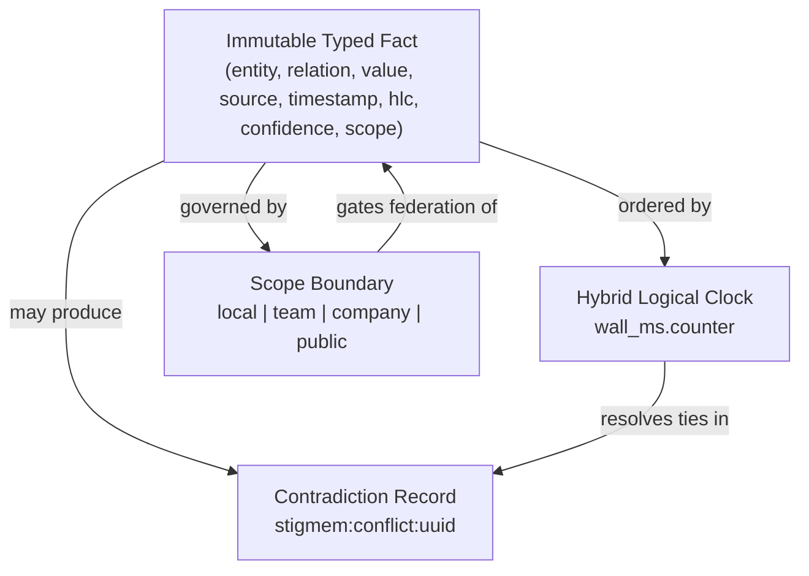

# How It Works

**Audience:** Protocol implementers, SDK authors, and curious operators who want to understand *why* Stigmem works the way it does — not just *how* to use it.

Every page in this section follows the same structure: we name a problem, show why the obvious solutions fail, explain our model, highlight what's non-obvious, and disclose the costs. If you want hands-on tutorials instead, start with the [Quickstart](../quickstart/index.md).

---

## The four primitives

Stigmem's entire architecture rests on four primitives. Every other feature — federation, decay, recall, tombstones — is a composition of these four.

### 1. Immutable typed facts

A fact is a single assertion — `(entity, relation, value, source, timestamp, hlc, confidence, scope)` — that is immutable once written. You never update a fact; you assert a new one. Retractions are themselves facts with `confidence = 0.0`. This design preserves a complete audit trail and makes contradiction detection tractable. See [Why Immutable Typed Facts](./why-immutable-typed-facts.md) and spec §2.

### 2. Hybrid Logical Clocks

Wall clocks drift; pure logical clocks lose human readability. Stigmem uses a Hybrid Logical Clock (HLC) — `"wall_ms.counter"` — to order every fact causally while staying close to real time. The HLC advances on every local write and on every inbound federated fact, giving you a total causal order across distributed nodes without a central coordinator. See [Hybrid Logical Clocks](./hybrid-logical-clocks.md) and spec §2.4.

### 3. Contradiction semantics

When two facts about the same `(entity, relation, scope)` disagree, Stigmem stores both and generates a first-class contradiction record. It never silently overwrites. Resolution follows a clear hierarchy: higher confidence wins, then higher HLC, then the caller decides. This conflict-first-class design is essential for federation — two nodes that diverge during a network partition will both survive, and contradictions surface explicitly when they reconnect. See [Conflict Semantics](./conflict-semantics.md) and spec §3.3.

### 4. Scope boundaries

Every fact carries a scope — `local`, `team`, `company`, or `public` — that governs its visibility and federation eligibility. Scopes are enforced at both read and write time. A `local` fact never leaves the node; a `public` fact can be replicated to any peer. Scope boundaries compose with federation peer declarations to form a two-factor authorization model: the fact's scope AND the peer's `allowed_scopes` must both permit replication. See [Federation Handshake](./federation-handshake.md) and spec §2.2, §6.4.

---

## Beyond the primitives

The four primitives compose into higher-level capabilities:

| Capability | Built from | Deep dive |
|---|---|---|
| [Decay & Confidence](./decay-and-confidence.md) | Facts + HLC + Scope | Gradual confidence reduction vs. binary expiry |
| [Federation Handshake](./federation-handshake.md) | Scope + HLC + Ed25519 peer tokens | How two nodes establish trust and replicate |
| [Source Trust & Quarantine](./source-trust-and-quarantine.md) | Facts + Scope + Org manifests | Weighted trust scores and isolation gardens |
| [Recall Pipeline](./recall-pipeline.md) | Facts + Graph + Embeddings | Three-stage retrieval with MMR packing |
| [Memory Cards](./memory-cards-as-fast-path.md) | Facts + Recall | Pre-computed entity summaries for fast recall |
| [Lazy Instruction Loading](./lazy-instruction-loading.md) | Facts + Recall + `instruction:` scope | On-demand agent instruction discovery |
| [Content Addressing](./content-addressing.md) | Facts + SHA-256 + JCS | Deterministic, tamper-evident fact IDs |
| [Time-Travel Queries](./time-travel-queries.md) | Facts + HLC + Retraction log | Querying the knowledge graph at a past point in time |
| [Tombstones & RTBF](./tombstones-and-rtbf.md) | Facts + Scope + Signed records | Right-to-be-forgotten compliance across federation |

---

## How to read these pages

Each page is self-contained. Read them in order for the full picture, or jump to the topic you care about. Every page cites the relevant spec section so you can cross-reference the normative language.

If you're implementing a Stigmem node, read all thirteen. If you're building an adapter or SDK, focus on [Immutable Typed Facts](./why-immutable-typed-facts.md), [Conflict Semantics](./conflict-semantics.md), and [Recall Pipeline](./recall-pipeline.md). If you're evaluating Stigmem for compliance, start with [Tombstones & RTBF](./tombstones-and-rtbf.md) and [Time-Travel Queries](./time-travel-queries.md).
