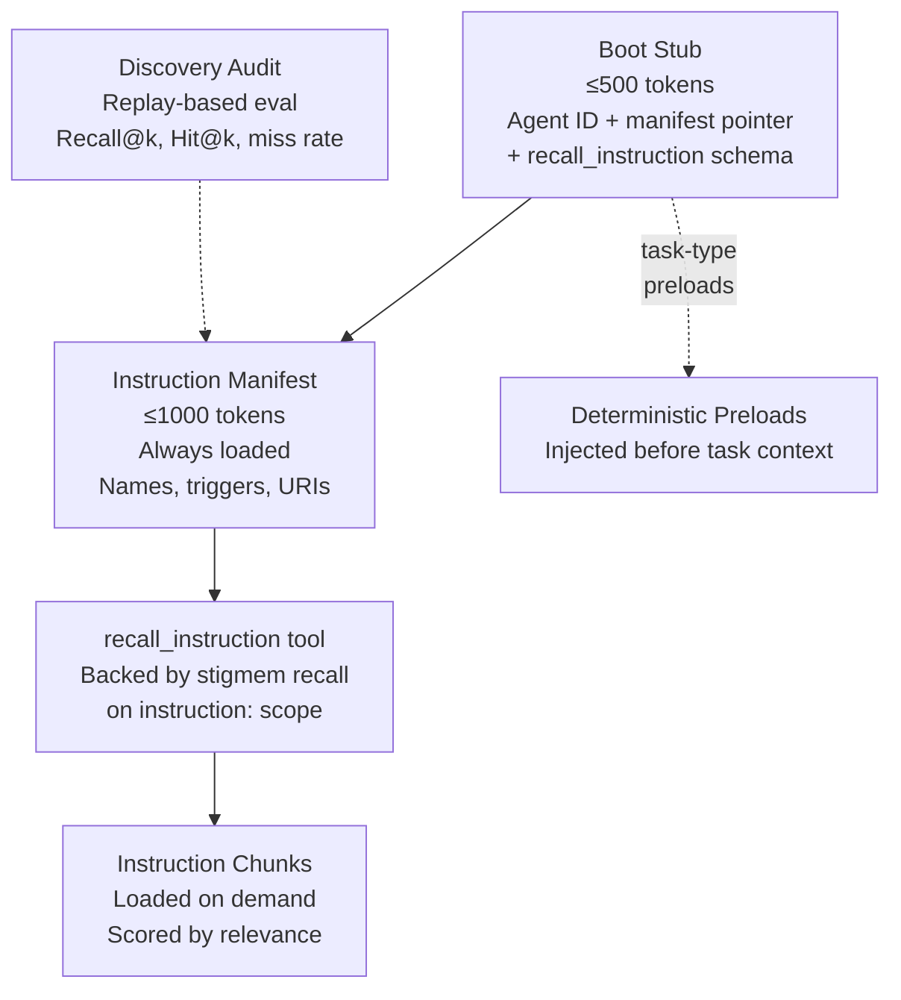

# Lazy Instruction Loading

**Audience:** Agent developers and platform operators.

## The problem

An AI agent may have dozens of instruction documents — heartbeat procedures, security policies, domain-specific playbooks, tool guides. Loading all of them into the context window at startup wastes tokens, slows boot time, and crowds out the task-specific context the agent actually needs for the current work.

But if you don't load them, the agent may miss critical instructions. A security policy that isn't in context is a security policy that isn't followed.

## Naive approaches and why they fail

**Load everything at boot.** Safe — the agent has all instructions in context. But a 50-document instruction set at 500 tokens each consumes 25,000 tokens before the agent even sees its task. In context-window-constrained runtimes, this leaves little room for the actual work.

**Load nothing; trust the agent to ask.** The agent is expected to know what it doesn't know and request the right instructions. But agents are stateless across heartbeats — they don't remember which instructions exist unless something tells them. An agent that doesn't know a security policy exists will never ask for it.

**Static task-type mapping.** Predefine which instructions load for which task types. Works for predictable workflows but fails for novel tasks. An agent encountering an unexpected situation won't load the relevant instructions because no one anticipated the mapping.

## Our model

Stigmem's lazy instruction loading uses three runtime components and one offline evaluation:



### Boot stub

The boot stub is the minimal preamble loaded at the start of every heartbeat. It contains:

| Field | Purpose |
|---|---|
| `agent_id` | Identifies this agent |
| `agent_role` | Human-readable role label |
| `manifest_uri` | Pointer to the instruction manifest |
| `recall_tool_schema` | JSON Schema for `recall_instruction` so the agent can call it |

The boot stub must fit in **500 tokens**. It does not contain operational instructions — those are loaded lazily.

**Exception:** Rules that are always applicable (mandatory escalation thresholds, universal security constraints, hard prohibitions) may be embedded directly in the boot stub. This is the primary mitigation against chronic instruction-scope misses: a rule that is always in context cannot be missed by a retrieval failure.

### Instruction manifest

The manifest is a compact index of all instruction units available to the agent. It fits in **1,000 tokens** and is always loaded. Each entry describes a unit with triggers, a URI, and a token estimate:

```json
{
  "name": "security-posture",
  "description": "Security constraints and escalation thresholds.",
  "load_triggers": {
    "intents": ["security rule", "escalation threshold"],
    "keywords": ["security", "escalate", "prohibited"]
  },
  "fact_uri": "instruction:acme/agent/cto/security-posture/v2",
  "token_estimate": 320
}
```

The manifest tells the agent *what exists* without loading *what it says*. The agent (or runtime) uses the triggers to decide when to call `recall_instruction`.

### `recall_instruction` tool

When the agent needs instructions, it calls `recall_instruction` with a natural-language intent:

```json
{
  "intent": "I need to check out an issue and start work",
  "max_chunks": 3,
  "token_budget": 1200
}
```

Under the hood, this is a stigmem `recall` call (spec §20.3) scoped to `instruction:` facts. The recall pipeline scores instruction units against the intent and returns the most relevant chunks, packed into the token budget.

### Task-type preloads

For structurally predictable situations, the manifest can declare units that are **deterministically preloaded** for specific wake reasons:

```json
{
  "name": "heartbeat-procedure",
  "required_by_task_types": ["issue_assigned", "issue_commented"],
  "guarantee_load": false
}
```

When the runtime detects a matching wake reason, it injects these units before the agent sees any task context. This is not semantic retrieval — it's deterministic injection. More than 2 declared task types per unit requires admin approval (to prevent "everything is critical" proliferation).

### Guaranteed units

Up to 5 manifest units per agent may be marked `guarantee_load: true`. These are always appended to `recall_instruction` responses regardless of relevance score. They are the nuclear option for instructions that must never be missed — at the cost of consuming token budget on every call.

## Why this is non-obvious

**The boot stub is deliberately minimal.** It seems risky to start an agent with only 500 tokens of instruction. But the manifest (another 1,000 tokens) gives the agent awareness of everything available, and `recall_instruction` provides the retrieval mechanism. The total "always loaded" cost is ~1,500 tokens — versus 25,000+ for full preloading.

**Instructions are facts in the knowledge graph.** Instruction units are stored as stigmem facts under the `instruction:` scope (spec §21.4). They're immutable, versioned, and carry provenance. A new version supersedes the old by setting `valid_until`. This means instruction management uses the same machinery as all other knowledge management — no separate instruction store.

**The discovery audit catches chronic misses.** The offline evaluation (spec §21.5) replays past heartbeats and measures whether the recall pipeline would have loaded the instructions the agent actually needed. Metrics include Recall@k (what fraction of needed units were retrieved?) and miss rate (how often did the agent proceed without a needed unit?). This is how you detect that a critical instruction is silently being missed.

**`guarantee_load` has a confidentiality tradeoff.** Guaranteed units are appended to every `recall_instruction` response. Any principal authorized to invoke `recall_instruction` — including via prompt injection — can observe their content. Content in guaranteed units must be safe for universal observation.

## What it costs

- **Retrieval quality risk.** If the recall pipeline doesn't surface the right instruction for a task, the agent proceeds without it. The discovery audit mitigates this but doesn't eliminate it. Always-applicable rules should go in the boot stub, not rely on retrieval.
- **Manifest authoring effort.** Someone must write the manifest entries — names, descriptions, trigger phrases, and token estimates for every instruction unit. Poor trigger phrases lead to poor retrieval.
- **Token budget per heartbeat.** Boot stub (~500 tokens) + manifest (~1,000 tokens) + recalled chunks (~1,200 tokens per call) + guaranteed units. Total instruction overhead is ~2,700 tokens per heartbeat — a significant saving over full preloading but not free.
- **Audit infrastructure.** The discovery audit requires storing every `recall_instruction` invocation and replaying it periodically. For high-throughput deployments, this adds storage and compute cost.

## References

- Spec §21.1 — Boot stub (required content, wire format, adapter profiles, task-type preloads)
- Spec §21.2 — Instruction manifest (token budget, entry shape, versioning)
- Spec §21.3 — `recall_instruction` tool contract (request/response, guaranteed units)
- Spec §21.4 — `instruction:` scope semantics (namespace, versioning, provenance, garden membership)
- Spec §21.5 — Discovery audit (Recall@k, Hit@k, miss rate, probe-set evaluation)
