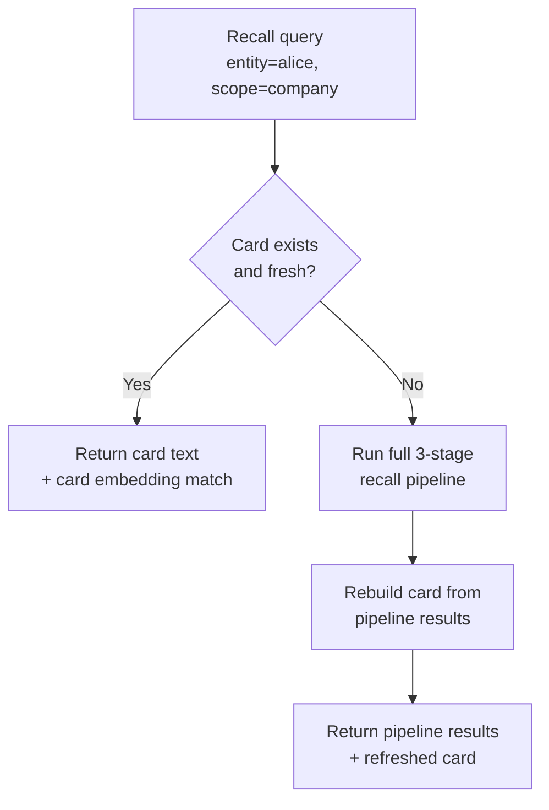

# Memory Cards as Fast Path

**Audience:** SDK authors and adapter developers.

## The problem

Recall queries often center on a single entity: "What do we know about Alice?" The recall pipeline (spec §20.3) is powerful but general-purpose — it runs three stages, fuses candidates, and packs results. For entity-centric queries where you already know *who* you're asking about, that full pipeline is overkill. You want a pre-computed summary that can be returned immediately and augmented by the full pipeline only when needed.

## Naive approaches and why they fail

**Cache the last recall result per entity.** The cached result goes stale the moment a new fact is asserted. You'd need a cache invalidation strategy that tracks every fact write per entity — which is effectively rebuilding the entity index.

**Denormalize facts into a document per entity.** Keep a running "profile" document that's updated on every fact write. But Stigmem's immutability invariant means facts aren't updated — they're appended. A document-per-entity model requires merge logic, handles contradictions poorly, and breaks provenance (the document has no single `source`).

**Embed the entity as a single vector.** One embedding per entity. But which facts go into it? All of them? Only high-confidence ones? How do you handle decay? A single vector loses the attributability that individual-fact embeddings provide.

## Our model

A **memory card** is a pre-computed summary of an entity's key facts at a given scope. It acts as a fast-path entry point for entity-centric recall: if a memory card exists and is fresh, it's returned directly. If not, the full recall pipeline runs and refreshes the card as a side effect.

### Card structure

```json
{
  "entity":          "stigmem://company.example/user/alice",
  "scope":           "company",
  "text":            "Alice is CEO (confidence 0.95). Prefers dark mode...",
  "fact_ids":        ["fact_01J...", "fact_02J...", "fact_03J..."],
  "confidence_agg":  0.87,
  "refreshed_at":    "2026-05-04T12:00:00Z",
  "stale_after":     "2026-05-04T14:00:00Z"
}
```

| Field | Purpose |
|---|---|
| `text` | Human-readable summary of the entity's top facts, ordered by confidence |
| `fact_ids` | References to the underlying facts (provenance trail) |
| `confidence_agg` | Aggregate confidence across included facts |
| `refreshed_at` | When this card was last computed |
| `stale_after` | When the card should be recomputed (operator-configurable) |

### How cards integrate with recall



When the caller sets `entity` in the recall request:

1. The pipeline checks for a fresh memory card for that entity and scope.
2. If the card exists and `refreshed_at > stale_after`, it is returned as the primary result, with additional pipeline results appended if the token budget allows.
3. If the card is stale or absent, the full pipeline runs. The card is rebuilt from the results and stored.
4. The caller can force a synchronous refresh with `force_refresh: true`.

### Card embeddings

Memory cards are also embedded in the `vec_facts` table with a composite ID (`"card:{entity_uri}:{scope}"`). This creates a secondary, entity-level vector index alongside the per-fact embeddings. During Stage 2 (dense retrieval), both per-fact and per-card embeddings are searched, giving the pipeline an entity-level entry point even for queries that don't explicitly name an entity.

### Card refresh policy

Cards are refreshed when:
- A new fact is asserted for the entity (lazy: marks the card stale, doesn't immediately rebuild)
- A decay sweep changes the confidence of an underlying fact
- A contradiction is resolved for the entity
- The caller requests `force_refresh: true`

The refresh is a background operation by default. Only `force_refresh` blocks the response.

### Divergence policy

When a memory card and the current fact set diverge (e.g., a fact has been retracted since the card was built), the node MUST NOT return a stale card that includes retracted facts. Implementations SHOULD check `fact_ids` against current fact state before serving a card, and MUST mark the card stale if any referenced fact has been retracted or tombstoned.

## Why this is non-obvious

**Cards are a cache, not a source of truth.** The underlying facts are always authoritative. A memory card is a convenience layer that accelerates common queries. If the card is stale, the pipeline rebuilds it from facts — the card never *replaces* the facts.

**Card embeddings complement fact embeddings.** A per-fact embedding captures one assertion in isolation. A card embedding captures the entity's overall profile. Semantic recall benefits from both: a query like "who knows about dark mode?" might miss individual `preference:theme` facts but match Alice's card because it mentions dark mode alongside other context.

**Tombstone interaction is strict.** A card whose `about_entity` is tombstoned (spec §23.3.2) is fully suppressed — not partially pruned. This ensures RTBF compliance even for pre-computed summaries.

**Cards don't federate.** Memory cards are local node state. They are not replicated to peers. Each node builds its own cards from its own fact store, which may differ from peer nodes due to replication lag or scope differences.

## What it costs

- **Storage.** One card per entity-scope pair, plus one embedding row. For a node with 10,000 entities and 4 scopes, that's up to 40,000 card rows and 40,000 embeddings — modest overhead.
- **Refresh latency.** Rebuilding a card requires reading all facts for the entity, computing the summary text, and re-embedding. For entities with hundreds of facts, this can take seconds. Background refresh amortizes this cost.
- **Staleness window.** Between a fact write and the next card refresh, the card is stale. The `stale_after` field makes this explicit, and the `force_refresh` option lets callers pay the cost when they need guaranteed freshness.
- **Garden ACL enforcement.** Cards must respect garden ACLs at read time (spec §20.4.4). A card built from facts in a restricted garden is only visible to callers with appropriate garden membership.

## References

- Spec §20.4 — Memory Cards (definition, schema, refresh policy, recall integration, divergence)
- Spec §20.2 — Embedding storage (card embedding IDs)
- Spec §20.3 — Recall API (card-first entity-centric recall)
- Spec §23.3.2 — Tombstone interaction with memory cards
