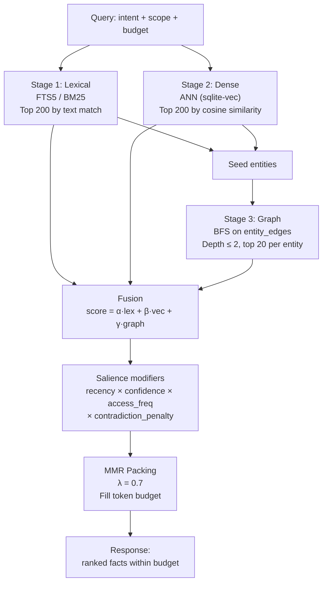

# Recall Pipeline

**Audience:** SDK authors, adapter developers, and protocol implementers.

## The problem

An agent asks: "What do we know about Alice's preferences?" The knowledge base holds thousands of facts across hundreds of entities. Returning all of them is useless — the agent has a finite context window. Returning only the top keyword match misses semantically related facts. Returning only the nearest embedding misses facts that are textually relevant but phrased differently. You need a retrieval system that combines multiple signals and packs results into a token budget.

## Naive approaches and why they fail

**Keyword search only (BM25/FTS).** Good for exact matches, but misses semantic similarity. "Alice likes dark themes" won't match a query for "UI preferences" unless the exact words overlap. In agent memory systems, the same concept is often expressed in different words across different sessions.

**Vector search only (ANN).** Good for semantic similarity, but loses precision. A query about "Alice's timezone" might retrieve "Bob's timezone" because the embeddings are close. Pure vector search also can't leverage the graph structure — it doesn't know that Alice is connected to Project Atlas, which has its own relevant facts.

**Keyword + vector, no graph.** Better — you get both precision and semantic coverage. But you miss the relational structure. Facts about Alice's employer, Alice's team, and Alice's projects are connected through `ref`-type values. Without graph expansion, a query about Alice returns only facts directly *about* Alice, not facts about entities one or two hops away that provide essential context.

## Our model

Stigmem's recall pipeline runs three stages in parallel, then fuses their candidate sets using a weighted formula and packs results into the caller's token budget using Maximal Marginal Relevance (MMR).



### Stage 1 — Lexical (FTS5 / BM25)

A full-text search against the facts FTS index. Returns up to 200 candidates ranked by BM25 score. This stage catches exact and near-exact textual matches.

### Stage 2 — Dense (ANN)

The query is embedded using the configured model (default: `nomic-embed-text-v1.5`, 768 dimensions, offline via Ollama). Approximate nearest neighbors are retrieved from the `vec_facts` table. Returns up to 200 candidates ranked by cosine similarity. Scope and confidence filters are applied via a join to the `facts` table — the vector index carries no scope column, so this join is mandatory to prevent cross-scope leakage.

### Stage 3 — Graph expansion (BFS)

Seed entities are the distinct entity URIs from the stage 1 and stage 2 candidate sets. The pipeline performs bounded-depth BFS on the `entity_edges` table (depth ≤ 2), collecting the top 20 facts per reached entity. Edge scoring penalizes hub entities to prevent high-degree nodes from dominating results:

```
graph_score = (1 / (1 + hops)) × edge.confidence / log(1 + out_degree)
```

### Fusion

Each candidate fact receives a fused score:

```
raw_score = α · norm(bm25) + β · norm(cosine_sim) + γ · norm(graph_score)
```

Default weights: `α = 0.30` (lexical), `β = 0.50` (vector), `γ = 0.20` (graph). These are provisional — operators should tune against a held-out probe set.

The raw score is then modulated by **salience factors**:

```
salience = recency × confidence_weight × access_freq × contradiction_penalty
```

Contradicted facts receive a 0.5× penalty. The final score determines ranking.

### Token-budget packing (MMR)

Results are packed into the caller's `token_budget` using Maximal Marginal Relevance:

```
MMR(f) = λ · score(f) - (1 - λ) · max_sim(f, already_selected)
```

`λ = 0.7` by default: biased toward relevance, with a diversity penalty to avoid redundant facts. The packer greedily adds the highest-MMR fact until the token budget is exhausted.

### Worked example

```bash
curl -X POST $STIGMEM_URL/v1/recall \
  -H "Authorization: Bearer $STIGMEM_API_KEY" \
  -d '{
    "query": "What are Alice preferences and current projects?",
    "token_budget": 2000,
    "scope": "company",
    "depth": 2,
    "weights": {"lexical": 0.30, "vector": 0.50, "graph": 0.20}
  }'
```

The response includes ranked facts within the token budget, with metadata on each fact's score, confidence, and source.

## Why this is non-obvious

**Three stages are not redundant.** Each stage catches facts the others miss. Lexical finds exact keyword matches that vector search might rank lower due to embedding noise. Vector finds semantically similar facts with different wording. Graph finds contextually relevant facts connected by `ref` edges that neither text-based stage would surface. Removing any one stage measurably degrades recall quality.

**The hub-bias guard matters.** Without the `log(1 + out_degree)` penalty, a root entity like `stigmem://company.example/org/acme` (which might have hundreds of outbound edges) would dominate every graph expansion. The penalty ensures that highly connected entities don't crowd out more specific, query-relevant neighbors.

**MMR is a diversity mechanism, not a deduplication mechanism.** Two facts might convey similar information without being duplicates (e.g., "Alice prefers dark mode" and "Alice's UI theme is dark"). MMR reduces the marginal value of the second fact, prioritizing diverse information within the budget — but it doesn't remove either fact from consideration.

**Scope enforcement happens in the vector stage join.** The `vec_facts` table has no `scope` column. Without the mandatory join to `facts` for scope filtering, ANN results could leak facts from scopes the caller isn't authorized to see. This is a cross-scope leakage guard, not a performance optimization.

## What it costs

- **Embedding infrastructure.** Vector search requires an embedding model. The default (nomic-embed-text-v1.5 via Ollama) runs offline, but adds ~2GB of model weight and GPU/CPU inference cost per query. Operators can choose cloud models (OpenAI, Voyage) for lower operational overhead at the cost of network dependency.
- **Graph index maintenance.** The `entity_edges` table must be updated atomically with every `ref`-type fact write and every decay sweep. This adds a write-amplification factor to all ref-typed assertions.
- **Tuning complexity.** The three-weight fusion formula, the salience modifiers, and the MMR lambda all interact. The defaults are reasonable but not optimal for every domain. Operators should evaluate against a domain-specific probe set (recall@10, MRR).
- **Latency.** Three stages run in parallel, but the graph stage depends on seeds from the other two. P95 recall latency scales with graph depth — depth 2 is the max for recall (vs. depth 3 for direct `neighbors()` queries) to keep latency bounded.

## References

- Spec §20.3 — Recall API (route, request shape, ranking pipeline, fusion formula)
- Spec §20.1 — Graph index (entity_edges schema, adjacency invariants, `neighbors()` semantics)
- Spec §20.2 — Embedding storage (vec_facts, model selection, embedding lifecycle)
- Spec §20.3.3 — Ranking pipeline stages and fusion formula
- Spec §19.4.4 — Recall-time trust multiplier (effective confidence)
