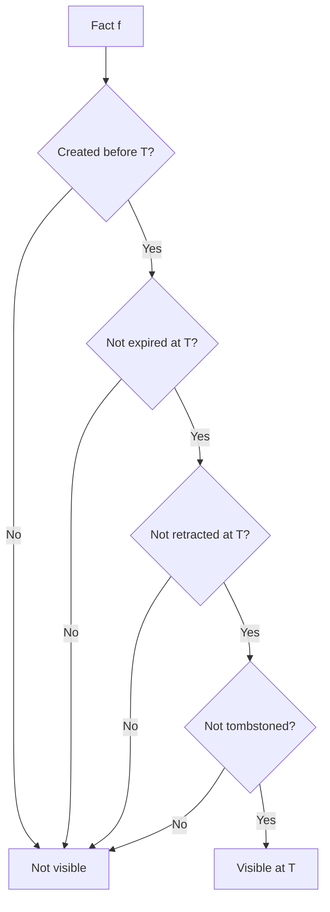

# Time-Travel Queries

**Audience:** Compliance teams, auditors, and protocol implementers.

## The problem

An auditor asks: "What did the knowledge graph say about Alice on January 1st?" A debugging engineer asks: "What facts were visible to the agent when it made that decision last Tuesday?" Both need to see the graph as it was — not as it is now. Facts may have been retracted, decayed, or tombstoned since then. The current view doesn't answer historical questions.

## Naive approaches and why they fail

**Snapshot the entire database periodically.** Store a full copy of the facts table every hour or day. This gives you point-in-time recovery but at enormous storage cost, and the granularity is limited to your snapshot interval. "What was visible at 2:47 PM?" falls between snapshots.

**Use git-style versioning on the facts table.** Every write creates a version, and you can check out any version. But Stigmem's facts table is append-only and immutable — there are no "versions" of a row. The challenge isn't tracking row mutations (there are none) but determining which facts were *visible* at a given time based on their `created_at`, `valid_until`, `confidence`, and tombstone state.

**Filter by `timestamp <= T`.** Close, but wrong. A fact might have been retracted between its creation time and T. You'd need to also check whether a retraction exists with a timestamp ≤ T. And you'd need to handle tombstones, which retroactively suppress facts regardless of timestamp.

## Our model

Stigmem provides an `as_of` parameter on recall and fact query endpoints that reconstructs fact visibility at any past timestamp.

### Fact visibility at time T

A fact `f` is visible at time T if **all four conditions** hold:



1. **Created before T.** `f.created_at <= T`
2. **Not expired at T.** `f.valid_until` is null or `f.valid_until > T`
3. **Not retracted at T.** No row in `fact_retractions` with `fact_id = f.id` and `retracted_at <= T`
4. **Not tombstoned.** No active tombstone covers `f.entity` at `f.scope` — unless the tombstone has `legal_hold: true` and the caller holds an admin key

Condition 3 uses the **append-only retraction log** (`fact_retractions` table), not the fact's current `confidence` field. This is critical: the in-place `confidence = 0.0` on the facts row reflects the *current* state, not the state at time T. The retraction log records *when* each retraction happened, enabling precise historical queries.

### Query interface

```bash
# What did Alice prefer on January 1st?
curl -X POST $STIGMEM_URL/v1/recall \
  -H "Authorization: Bearer $STIGMEM_API_KEY" \
  -d '{
    "intent": "What are Alice preferences?",
    "as_of": "2025-01-01T00:00:00Z",
    "scope": "company",
    "max_facts": 20
  }'

# Direct fact query with as_of
curl "$STIGMEM_URL/v1/facts?entity_uri=stigmem://company.example/user/alice&as_of=2025-01-01T00:00:00Z&scope=company" \
  -H "Authorization: Bearer $STIGMEM_API_KEY"
```

The `as_of` parameter is validated:
- Must be a valid ISO 8601 timestamp
- Must not be in the future (5-second clock-skew tolerance)
- Must not predate the deployment's retention horizon

### Tombstone interaction

Tombstones interact with time-travel in two modes:

| Tombstone mode | `as_of` behavior |
|---|---|
| `legal_hold: false` (default) | **Retroactive suppression.** The entity's facts are excluded from ALL `as_of` queries, even those predating the tombstone. The graph history is presented as if the entity never existed. |
| `legal_hold: true` | **Preserved for admin audit.** Live queries suppress the entity. `as_of` queries with an admin API key return the facts annotated with `tombstone_notices`. Agent API keys still see retroactive suppression. |

The `legal_hold` mode exists for regulatory scenarios where a data controller must preserve records for legal proceedings while removing them from operational use.

### Monotonicity invariant

For any two queries `as_of=T1` and `as_of=T2` where `T1 < T2`, the facts visible at T1 must be a subset of those visible at T2 — *before* accounting for tombstones, retraction, or expiry. This ensures callers can reason about the causal evolution of the graph: new facts only appear, they never vanish from the timeline (unless retracted or tombstoned).

## Why this is non-obvious

**The retraction log exists because immutability isn't enough.** Facts are immutable, but their *effective state* changes when they're retracted. Setting `confidence = 0.0` on the fact row records the current state but destroys the timestamp of when the retraction happened. The `fact_retractions` table preserves that timestamp, making `as_of` queries possible without scanning the entire fact history.

**Tombstone retroactivity violates monotonicity.** The monotonicity invariant holds for fact creation — but tombstones can retroactively remove facts from historical views. This is intentional: RTBF compliance requires that the data subject's existence is erased from the historical record, not just from the current view. The spec explicitly documents this as a controlled violation.

**Agent keys get silent suppression.** When an `as_of` query would surface `legal_hold` facts and the caller is an agent key, the response is silently filtered — identical to a non-legal-hold tombstone. The agent cannot distinguish "no facts exist" from "facts are hidden by legal hold." Only admin keys see the `tombstone_notices` annotation. This prevents agents from inferring the existence of legal proceedings.

**Cursor stability across tombstones is not guaranteed.** If a tombstone is applied between paginated `as_of` requests, rows visible on page 1 may be absent from page 2. The spec does not require implementations to snapshot tombstone state per cursor — each page is tombstone-filtered at request time.

## What it costs

- **Retraction log storage.** One row in `fact_retractions` per retraction event. For high-churn relations with frequent retractions, this adds proportional storage.
- **Query complexity.** `as_of` queries must join the `facts` table with `fact_retractions` on a timestamp condition, plus check tombstones. This is more expensive than a live query. Implementers should index `fact_retractions(fact_id, retracted_at)`.
- **Retention horizon.** Operators must decide how far back `as_of` queries can reach. There is no spec-mandated minimum, but very old queries may scan large swaths of the facts table.
- **Tombstone cache refresh lag.** The 60-second LRU cache for tombstone lookups applies to `as_of` queries too. A tombstone issued in the last 60 seconds may not yet suppress a concurrent `as_of` query.

## References

- Spec §24.1 — Time-travel scope (historical auditing, regulatory compliance)
- Spec §24.2 — As-of query semantics (fact visibility rules, query interface, monotonicity)
- Spec §24.3 — Tombstone interaction (retroactive suppression, legal-hold, response annotations)
- Spec §24.4 — Storage-trait extension (`query_facts_as_of`, `recall_as_of`)
- Spec §23.5.3 — `fact_retractions` table (Migration 013c)
