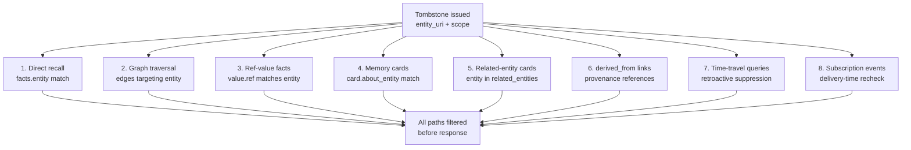

# Tombstones & Right-to-Be-Forgotten

**Audience:** Compliance teams, data-protection officers, and protocol implementers.

## The problem

A user invokes their right to be forgotten under GDPR Article 17 or CCPA §1798.105. The knowledge graph holds facts about them across multiple scopes, memory cards, graph edges, and federated peer nodes. Simply deleting the rows isn't enough — the user's data must vanish from recall results, graph traversals, time-travel queries, and pre-computed summaries. And the suppression must propagate to every federation peer that holds replicated facts about the entity.

You need a mechanism that is durable (survives restarts), signed (tamper-evident), retroactive (erases the entity from historical views), and federated (propagates to peers without re-signing).

## Naive approaches and why they fail

**Hard-delete the rows.** `DELETE FROM facts WHERE entity = 'user:alice'`. The facts disappear from the local node, but federated peers still have replicated copies. The next sync may re-import the deleted facts. And there's no audit trail that a deletion happened — a compliance auditor can't verify that the erasure was performed.

**Set `confidence = 0.0` on the facts.** A soft-delete using the existing retraction mechanism. But retractions are reversible (a new assertion can raise confidence back). Retractions don't propagate to peers as a suppression directive. And a retracted fact still exists in the table — a direct query or database export can reveal it.

**Add a `deleted` flag to the facts table.** The flag suppresses facts from queries. But the flag is per-fact, not per-entity — you'd need to find and flag every fact, memory card, and graph edge referencing the entity. There's no signature (anyone with write access can flip the flag), no federation propagation, and no interaction with time-travel queries. A `deleted` flag is a local convenience, not a compliance primitive.

## Our model

Stigmem uses **tombstone records** — signed, immutable directives stored in a dedicated `tombstones` table — to implement RTBF. A tombstone names an entity and a scope pattern, and every node that holds it must suppress matching facts from all query paths.

### Tombstone record shape

```json
{
  "id":         "tomb_01J...",
  "entity_uri": "stigmem://company.example/user/alice",
  "scope":      "*",
  "reason":     "GDPR Art. 17 erasure request #2026-042",
  "signed_by":  "stigmem://company.example/admin/dpo",
  "key_id":     "a3f8c1...",
  "signature":  "<base64url Ed25519 signature>",
  "created_at": "2026-05-01T10:00:00Z",
  "legal_hold": false
}
```

| Field | Purpose |
|---|---|
| `entity_uri` | The entity to suppress — exactly one URI, no wildcards |
| `scope` | Which scopes to suppress: `"*"` (all), a single scope, or an array |
| `signed_by` | Admin agent or service that signed the tombstone |
| `key_id` | SHA-256 of the signing key — lets verifiers find the right key after rotation |
| `signature` | Ed25519 over the canonical-JSON body (RFC 8785), excluding `signature` and `reason` |
| `legal_hold` | When `true`, preserves facts for admin audit while suppressing from operational recall |

The signature is computed over the canonical body with `signature` and `reason` excluded. Excluding `reason` allows the issuing node to redact it to `"redacted"` before federation rebroadcast without invalidating the signature.

### Eight suppression paths

A tombstone must suppress the entity across every query path in the system:



1. **Direct recall** — facts whose `entity` matches the tombstoned URI are excluded
2. **Graph traversal** — edges targeting the entity are pruned; BFS does not propagate through tombstoned nodes
3. **Ref-value facts** — facts whose `value` is a `ref` pointing to the entity are excluded
4. **Memory cards** — cards whose `about_entity` is tombstoned are fully suppressed (not partially pruned)
5. **Related-entity cards** — the tombstoned entity is removed from `related_entities`; if the card text still contains PII, the card is suppressed entirely
6. **Derived-from links** — provenance entries referencing the entity are returned as `{"hash": "...", "exists": false}`
7. **Time-travel queries** — retroactive suppression removes the entity from all `as_of` results (see below)
8. **Subscription events** — tombstone filter is re-evaluated at delivery time, not subscription time

The tombstone check runs after scope filtering and before token-budget packing. Result counts, pagination totals, and HTTP headers must reflect the post-filter set — no metadata may reveal that suppressed facts existed.

### Issuing and revoking tombstones

```bash
# Issue a tombstone (admin key required)
curl -X POST $STIGMEM_URL/v1/tombstones \
  -H "Authorization: Bearer $STIGMEM_ADMIN_KEY" \
  -d '{
    "entity_uri": "stigmem://company.example/user/alice",
    "scope": "*",
    "reason": "GDPR Art. 17 erasure request #2026-042",
    "legal_hold": false
  }'
# → 201 { "id": "tomb_01J...", "signature": "...", ... }

# Check tombstone status
curl $STIGMEM_URL/v1/tombstones/stigmem%3A%2F%2Fcompany.example%2Fuser%2Falice \
  -H "Authorization: Bearer $STIGMEM_ADMIN_KEY"
# → 200 { "tombstoned": true, "tombstones": [...], "revocations": [] }

# Revoke a tombstone (requires documented legal basis)
curl -X POST $STIGMEM_URL/v1/tombstones/tomb_01J.../revoke \
  -H "Authorization: Bearer $STIGMEM_ADMIN_KEY" \
  -d '{"reason": "Court order #2026-CR-1234 reinstating data access"}'
# → 200 { "id": "tombrevoke_01J...", ... }
```

Tombstones are immutable once written — you cannot update or delete a tombstone record. Revocation is a separate signed record (`TombstoneRevocationRecord`) that instructs nodes to re-expose the suppressed facts. The original tombstone remains in the table for audit.

### Federation propagation

Tombstones propagate to all federation peers via a dedicated route:

```
GET /v1/federation/tombstones?since=<ISO8601>&limit=<N>
Authorization: Bearer <peer capability token with "tombstone:read" verb>
```

The propagation follows three rules:

1. **Original signature preserved.** Peer nodes verify the tombstone against the *issuing org's* manifest, not the relaying peer's manifest. The `key_id` field resolves the correct historical signing key from the rotation chain.
2. **Reason may be redacted.** The issuing node can replace `reason` with `"redacted"` before rebroadcast — the signature remains valid because `reason` is excluded from the signed body.
3. **Peers must poll.** Standard mode: poll every 5 minutes. On receiving a `tombstone_new` subscription event: poll within 60 seconds. A tombstone takes effect within 60 seconds of local receipt (bounded by the LRU cache refresh).

Failed signature verification emits a `tombstone_verification_failed` audit event. Nodes must never silently drop inbound tombstones.

### Time-travel interaction

Tombstones interact with `as_of` queries in two modes:

| Mode | Live recall | `as_of` queries |
|---|---|---|
| `legal_hold: false` (default) | Suppressed | **Retroactive suppression.** Entity excluded from ALL `as_of` results, even those predating the tombstone. History presented as if entity never existed. |
| `legal_hold: true` | Suppressed | **Preserved for admin audit.** Admin API keys see facts annotated with `tombstone_notices`. Agent API keys see silent suppression (identical to default mode). |

The `legal_hold` mode exists for regulatory scenarios — like a court-ordered data preservation — where a controller must keep records for legal proceedings while removing them from operational use. Issuing a `legal_hold` tombstone emits an `rtbf_legal_hold_issued` audit event.

Agent API keys can never distinguish "no facts exist" from "facts are hidden by legal hold." This prevents agents from inferring the existence of legal proceedings.

## Why this is non-obvious

**Tombstones are not facts.** They're stored in a separate `tombstones` table, not as facts with special metadata. This is deliberate: facts are the *subject* of suppression, so the suppression mechanism must exist outside the fact store. A tombstone that was itself a fact could be suppressed by another tombstone, creating circular dependencies.

**Retroactive suppression violates the monotonicity invariant.** The time-travel monotonicity invariant (§24.2.3) says that facts visible at T1 must be a subset of those at T2 when T1 < T2. Tombstones deliberately violate this — they retroactively remove facts from *all* historical views. The spec documents this as a controlled violation: RTBF compliance requires erasing the data subject from the historical record, not just the current view.

**Signature verification uses the issuing org's manifest, not the relaying peer's.** When Node B forwards a tombstone originally issued by Node A, Node C verifies against Node A's org manifest. This prevents a compromised relay from forging tombstones — every tombstone is cryptographically bound to the admin who issued it, regardless of the delivery path.

**The `reason` exclusion from signing is a privacy feature.** The reason may contain PII or legal case details ("GDPR request from alice@example.com re: case #2026-042"). Excluding it from the signature lets the issuing node redact it before sending to peers, while peers can still verify the tombstone's authenticity. The reason is for the issuing node's audit log, not for the federation mesh.

**Cursor stability across tombstones is not guaranteed.** If a tombstone is applied between paginated `as_of` requests, facts visible on page 1 may disappear from page 2. The spec does not require snapshotting tombstone state per cursor — each page is tombstone-filtered at request time. Callers must not infer suppression from inter-page count differences.

## What it costs

- **Admin-only issuance.** Tombstones require an admin API key. There is no self-service RTBF endpoint for agents or end users — the operator must intermediate. This is intentional: tombstone issuance is a compliance action, not an application feature.
- **60-second propagation window.** The LRU cache for tombstone lookups refreshes every 60 seconds. During this window, a recently tombstoned entity may still appear in recall results on the local node. Federation adds additional latency — a peer may not apply the tombstone for up to 5 minutes (the poll interval) plus 60 seconds (local cache).
- **Irrevocable by design.** Tombstones cannot be deleted, only revoked with a separate signed record that requires a documented legal basis. Accidental tombstones require a formal revocation. This friction is intentional — RTBF compliance demands that erasure is deliberate.
- **No partial suppression.** A tombstone covers an entire entity at the specified scope — you cannot tombstone individual facts. If only some facts about an entity need suppression, the operator must use retractions for the specific facts and reserve tombstones for full-entity erasure.
- **Federation signature verification cost.** Each inbound tombstone requires resolving the issuing org's manifest and verifying an Ed25519 signature. For high-volume tombstone propagation, this adds per-tombstone latency — though in practice, RTBF tombstones are infrequent.

## References

- Spec §23.1 — Tombstone scope and compliance context (GDPR Art. 17, CCPA §1798.105)
- Spec §23.2 — TombstoneRecord shape (schema, invariants, scope patterns, canonical JSON, revocation)
- Spec §23.3 — Recall-time tombstone filter (direct-entity, graph-reference, completeness rules, LRU cache)
- Spec §23.4 — Federation propagation (outbound rebroadcast, inbound handling, dedicated route)
- Spec §23.5 — Storage-trait extension (tombstone/is_tombstoned/list/revoke methods, schema migration)
- Spec §23.6 — Wire format (issue, check status, revoke endpoints)
- Spec §23.7 — Error reference
- Spec §24.3 — Time-travel tombstone interaction (retroactive suppression, legal-hold, response annotations)
