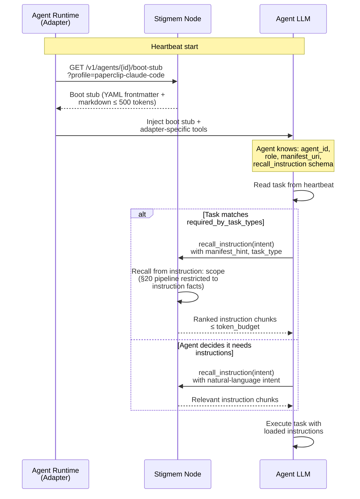
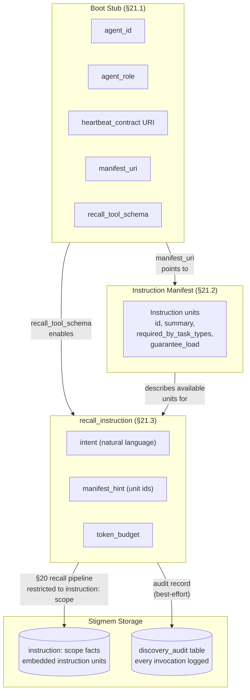

# Lazy Instruction Boot

*Audience: engineers building agent runtimes or adapters that use Stigmem's lazy instruction discovery (spec §21).*

Instead of preloading every instruction document at startup, agents discover and load instructions on demand. The system has three runtime components — a **boot stub**, an **instruction manifest**, and the **`recall_instruction` tool** — plus an off-path **discovery audit** for retrieval-quality evaluation.

## Boot sequence



## Component architecture



## Boot stub structure

The boot stub is a markdown document with YAML frontmatter:

```yaml
---
agent_id: "8e0ed057-bcd8-4f8f-92ee-c046c55b64e9"
agent_role: "CTO"
heartbeat_contract: "instruction:acme/heartbeat-contract/v1"
manifest_uri: "instruction:acme/agent/cto/manifest/v1"
stub_version: 1
adapter_profile: "paperclip-claude-code"
---

# Agent Boot Stub

You are **CTO** (id: `8e0ed057-...`).
Call `recall_instruction(intent)` to load relevant sections.
```

## Instruction load strategies

| Strategy | When | How |
|----------|------|-----|
| Task-type preload | Task matches a unit's `required_by_task_types` | Deterministically loaded at heartbeat start before agent sees the task |
| Guarantee load | Unit has `guarantee_load: true` | Always appended to every `recall_instruction` response (max 5 per agent) |
| On-demand recall | Agent decides it needs context | Agent calls `recall_instruction` with natural-language intent |
| Boot stub embedding | Rule is always applicable | Embedded directly in boot stub body (security constraints, escalation thresholds) |
