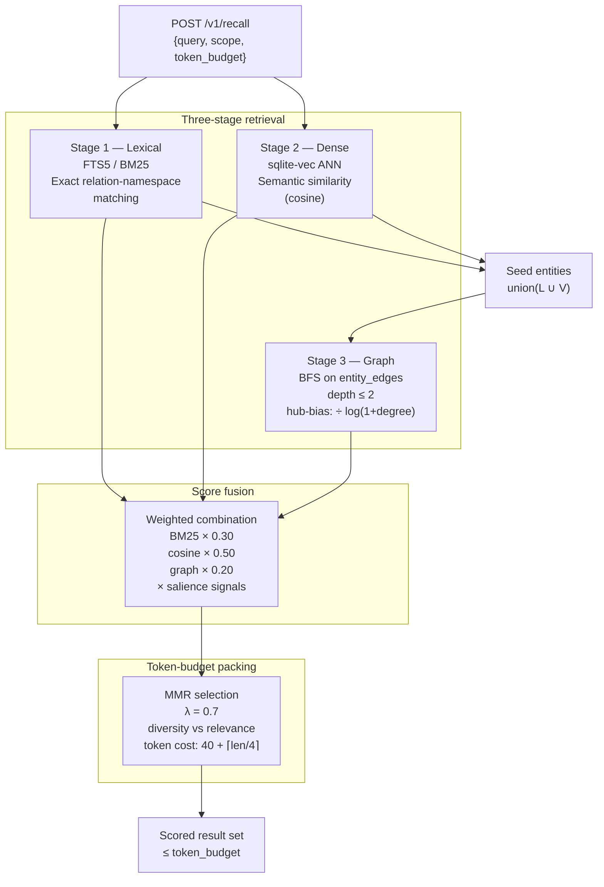

# Recall Pipeline

*Audience: engineers building recall-capable agents or contributing to the recall subsystem (spec §20).*

The recall pipeline retrieves semantically relevant facts for agent queries. It runs three independent retrieval stages, fuses their results with salience signals, and packs the output within a caller-specified token budget using Maximal Marginal Relevance (MMR).

## Pipeline overview



## Salience signals

Applied during the fusion step to adjust raw retrieval scores:

| Signal | Formula | Range |
|--------|---------|-------|
| Recency | `exp(-0.01 × age_days)` | (0, 1] |
| Confidence | `fact.confidence` | [0, 1] |
| Access frequency | `log(1 + access_count) / log(1 + max_access_count)` | [0, 1] |
| Contradiction penalty | 1.0 if no unresolved contradiction; 0.7 otherwise | {0.7, 1.0} |
| Garden tier | Configurable per garden; quarantine default 0.2 | [0, 1] |
| Source-trust multiplier | `0.5 + 0.5 × t` (maps [0,1] → [0.5,1.0]) | [0.5, 1] |

## Security: ANN scope filter

`vec_facts` holds embeddings for all scopes with no `scope` column. Stage 2 ANN results **must** be joined back against the `facts` table and filtered by the caller's scope and garden ACL before being passed to fusion. Without this filter, facts from unauthorized gardens could leak into the response.

## Example

```bash
curl -X POST http://localhost:8765/v1/recall \
  -H "Authorization: Bearer $KEY" \
  -d '{
    "query": "What is Alice'\''s current role?",
    "scope": "company",
    "token_budget": 2000,
    "weights": {"lexical": 0.3, "vector": 0.5, "graph": 0.2}
  }'
```
