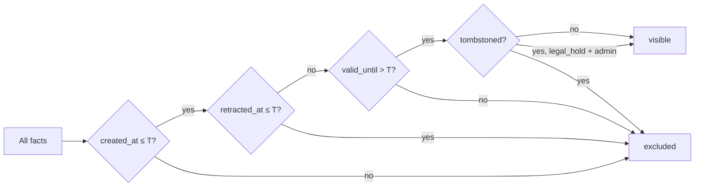

# Time-Travel Queries

**Audience:** Integrators and operators who need to query historical fact state — audit trails, regulatory snapshots, or debugging temporal inconsistencies.

Stigmem supports **point-in-time queries** via the `as_of` parameter on both the fact query and recall endpoints. Instead of returning the current fact set, the node reconstructs what was visible at the specified timestamp. The full protocol is defined in spec §24.

---

## How it works

When you pass `as_of=<ISO 8601 timestamp>`, the node applies three filters to reconstruct the fact set at time T:

1. **Assertion filter** — only facts with `created_at ≤ T` are included.
2. **Retraction filter** — facts retracted before T (recorded in the append-only `fact_retractions` log) are excluded. This uses `retracted_at ≤ T`, not the current `confidence` field.
3. **Expiry filter** — facts with `valid_until ≤ T` are excluded.
4. **Tombstone filter** — RTBF tombstones (§23) apply retroactively: tombstoned entities are suppressed even in historical views, unless the caller holds an admin key and the tombstone has `legal_hold: true`.



---

## Querying facts at a point in time

### Via curl

```bash
# Facts for user:alice as they existed on 2026-04-15
curl -s "http://localhost:8765/v1/facts?entity=user:alice&as_of=2026-04-15T00:00:00Z" \
  -H "Authorization: Bearer $TOKEN" | jq '.facts[] | {entity, relation, value}'
```

### Via the Python SDK

The `as_of` parameter is passed directly to the REST API query string:

```python
import httpx

resp = httpx.get(
    "http://localhost:8765/v1/facts",
    params={"entity": "user:alice", "as_of": "2026-04-15T00:00:00Z"},
    headers={"Authorization": f"Bearer {TOKEN}"},
)
for fact in resp.json()["facts"]:
    print(fact["relation"], fact["value"])
```

---

## Recall at a point in time

The `recall` endpoint accepts `as_of` in the request body. The hybrid ranker (BM25 + vector + graph) operates over the historical fact set.

```bash
curl -s -X POST http://localhost:8765/v1/recall \
  -H "Authorization: Bearer $TOKEN" \
  -H "Content-Type: application/json" \
  -d '{
    "query": "alice engineering role",
    "scope": "local",
    "token_budget": 2000,
    "as_of": "2026-04-15T00:00:00Z"
  }' | jq '.facts[] | {score, entity: .fact.entity, relation: .fact.relation}'
```

---

## Validation rules (§24.2.2)

The `as_of` timestamp must satisfy:

| Rule | Error code | Description |
|------|------------|-------------|
| Valid ISO 8601 | `as_of_invalid_timestamp` | Must parse as a valid ISO 8601 datetime |
| Not in the future | `as_of_future` | Must not exceed `now() + 5s` (clock-skew tolerance) |
| Above retention floor | `as_of_before_retention_floor` | Must not predate the deployment's configured retention horizon |

The retention floor is configured via `STIGMEM_AS_OF_RETENTION_FLOOR` (ISO 8601 timestamp). Queries before this date return `400`.

---

## Legal hold and admin access (§24.3)

Tombstones apply retroactively to time-travel queries — a tombstoned entity is suppressed even in historical views. The exception:

- **Admin callers** querying a `legal_hold: true` tombstone can see the facts, annotated with `tombstone_status: "legal_hold"`.
- **Agent-key callers** always get empty results for tombstoned entities, regardless of `as_of`.

This ensures RTBF compliance while preserving admin audit capability.

---

## Retraction data model (§24.2.1)

Retractions are recorded in an append-only `fact_retractions` table rather than by zeroing `confidence` in place. This is critical for time-travel correctness:

- `fact_retractions.retracted_at` is the authoritative timestamp for when a fact was retracted.
- The `as_of` query gates on `retracted_at ≤ T`, not on `confidence = 0.0`.
- This means a fact retracted at T₂ is still visible in queries where `as_of < T₂`.

---

## Pagination and tombstone filtering

Query pagination totals are computed **post-filter** to prevent oracle leakage (§23.3.3 rule 3). If tombstone filtering is applied, the `total` field in the response is `null` rather than exposing the count of suppressed records.

Cursor-based pagination works the same as for non-time-travel queries: use the `cursor` field from the response to fetch the next page.

---

## Operator configuration

| Environment variable | Default | Description |
|---------------------|---------|-------------|
| `STIGMEM_AS_OF_RETENTION_FLOOR` | (none) | ISO 8601 timestamp; queries before this date are rejected |

If not set, there is no floor — queries can go back to the earliest fact in the database.

---

## See also

- [RTBF Tombstones](./rtbf.md) — entity erasure and how tombstones interact with time-travel
- [Content Addressing](./content-addressing.md) — CID-based fact lookup across time
- [Recall guide](./recall.md) — hybrid recall without the time-travel parameter
- [API Reference](/docs/api-reference) — full endpoint documentation
