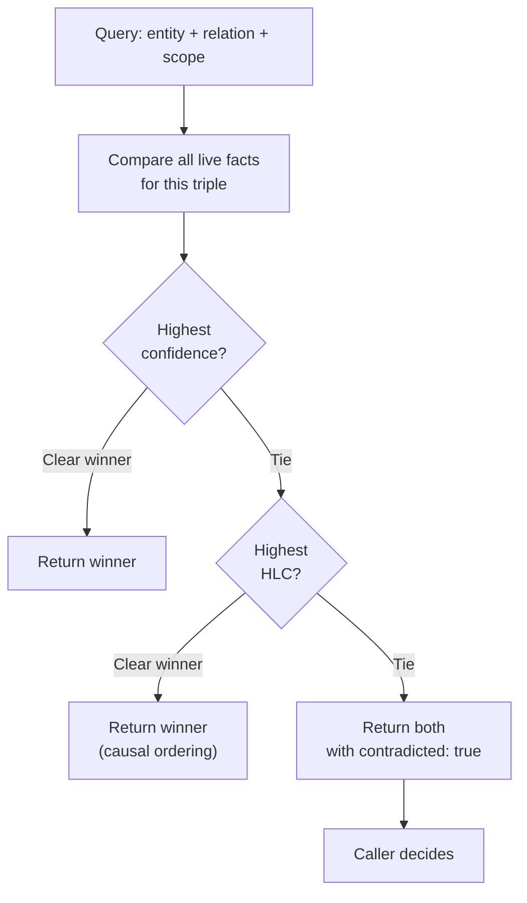
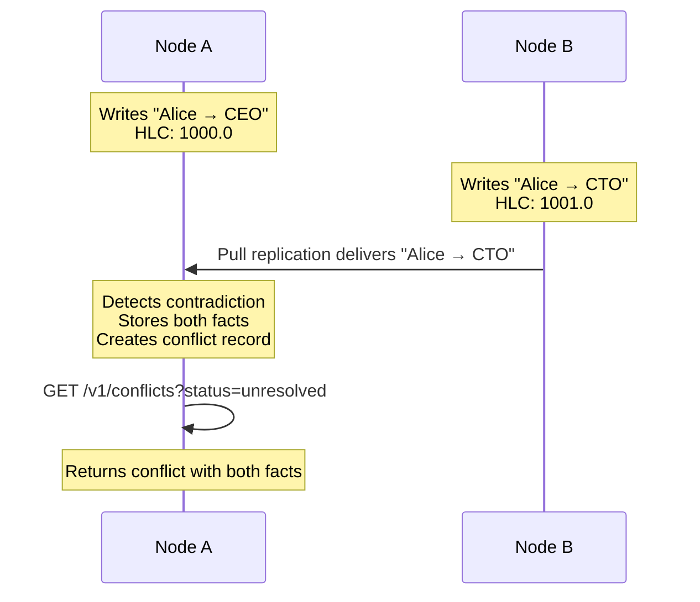

# Conflict Semantics

**Audience:** Protocol implementers, adapter authors, and node operators.

## The problem

Two sources assert different values for the same thing. Agent A says Alice's role is "CEO." Agent B says it's "CTO." Both are confident. Which is right?

In a single-node system, you might impose last-write-wins and move on. But in a federated network where nodes operate independently during partitions, two legitimate assertions can arise concurrently with no causal relationship between them. Silently picking a winner means silently losing information — and in a compliance-sensitive system, that's unacceptable.

## Naive approaches and why they fail

**Last-write-wins (LWW).** The fact with the latest timestamp overwrites the other. Simple, but destructive: the "loser" vanishes without a trace. If both writes happened during a partition, the choice of winner depends on clock accuracy — not correctness. LWW also prevents you from answering "was there ever a disagreement about this?"

**Operational transforms (OT) or CRDTs.** These work well for convergent data types (counters, sets, text), but agent knowledge doesn't fit neatly into CRDT shapes. "Alice is CEO" vs. "Alice is CTO" is not a merge operation — it's a semantic disagreement that requires human or agent judgment to resolve. Forcing CRDT semantics onto it produces a technically correct but meaningless result.

**Central arbiter.** A coordinator node decides all conflicts. This works until the coordinator is unreachable, at which point the entire federation stalls. It also introduces a trust asymmetry: why should Node B trust Node A's judgment on a conflict involving Node B's data?

## Our model

Stigmem treats contradictions as **first-class facts**. Both values are stored. Neither is silently overwritten. A system-generated contradiction record links them.

### Contradiction detection

A contradiction exists when two facts `a` and `b` satisfy all of:

- `a.entity == b.entity`
- `a.relation == b.relation`
- `a.scope == b.scope`
- `a.value != b.value`
- `a.confidence > 0.0 && b.confidence > 0.0`

When detected (at write time, including federated ingest), the node asserts a contradiction record:

```json
{
  "entity":   "stigmem:conflict:<uuid>",
  "relation": "stigmem:conflict:between",
  "value":    { "type": "text", "v": "<fact-id-a> <fact-id-b>" },
  "source":   "system:stigmem",
  "confidence": 1.0,
  "scope":    "<same scope as the conflicting facts>"
}
```

### Resolution order at query time

When a caller queries for a contradicted entity-relation pair, the node resolves as follows:



1. **Higher confidence wins.** A fact asserted with `confidence: 0.95` beats one with `confidence: 0.7`.
2. **Equal confidence → higher HLC wins.** The causally later fact takes precedence.
3. **True tie → both returned.** Each fact is annotated with `contradicted: true`. The caller (human or agent) must decide.

### Explicit resolution

A human or agent resolves a conflict through `POST /v1/conflicts/:id/resolve`:

```bash
curl -X POST $STIGMEM_URL/v1/conflicts/$CONFLICT_ID/resolve \
  -H "Authorization: Bearer $STIGMEM_API_KEY" \
  -d '{
    "winning_fact_id": "fact_01J...",
    "resolution_note": "Confirmed with Alice: title is CEO as of Q2."
  }'
```

The resolution is itself a new fact with provenance — you can trace who resolved it, when, and why. Both original facts remain in the store, immutable. The conflict status updates to `"resolved"`.

### Federation and conflicts

Conflicts across federated nodes are expected, not exceptional. When Node A ingests a fact from Node B that conflicts with a local fact:

1. Both facts are stored.
2. A contradiction record is generated on the ingesting node.
3. Both facts are returned to callers with `contradicted: true`.
4. Conflict entities (`stigmem:conflict:<uuid>`) are local — they are never federated (to prevent infinite loops).



## Why this is non-obvious

**Storing both sides seems redundant.** It's not. In a federated system, the "wrong" value on one node may be the "right" value on another — they just haven't reconciled yet. Discarding either side before explicit resolution destroys information that may be needed for compliance, auditing, or debugging.

**Contradiction records are facts about facts.** The `stigmem:conflict:between` entity is itself an immutable fact in the store. This means you can query, filter, and subscribe to conflicts the same way you query any other fact. No special-purpose conflict API is needed for monitoring — though one is provided for convenience in Spec-03-HTTP-API.

**Resolution doesn't delete.** Resolving a conflict asserts a *new* winning fact and marks the conflict as resolved. The original conflicting facts are untouched. This preserves the full decision history: you can reconstruct not just what the final answer was, but what the competing values were and who adjudicated.

**Entity normalization prevents ghost conflicts.** Before pre-reset, `project/EG-18` and `project/eg-18` were treated as different entities — so their conflicting facts would never be detected. The strict normalizer (Spec-01-Fact-Model entity normalization) ensures case-variant URIs map to the same canonical form, closing this gap.

## What it costs

- **Storage for conflict records.** Every contradiction produces at least two additional fact rows (the `stigmem:conflict:between` and `stigmem:conflict:status` facts). In high-contradiction environments, this overhead is proportional to the number of disagreements.
- **Query latency for contradicted triples.** Returning two facts instead of one means more data to serialize and more for the caller to process. The `include_contradicted=false` default hides this from callers who don't need it.
- **Operator attention.** Unresolved conflicts accumulate. The lint operation (Spec-20-Lint-Semantics) includes a contradiction check that surfaces unresolved conflicts; operators should run it periodically and resolve or escalate stale contradictions.
- **No automatic merge.** Stigmem never guesses. If two values conflict and neither has higher confidence or a later HLC, the system surfaces the ambiguity rather than inventing a resolution. This is a deliberate tradeoff: correctness over convenience.

## References

- Spec Spec-15-Fact-Semantics — Contradiction detection, resolution order, and contradiction fact shape
- Spec-03-HTTP-API — List conflicts wire format
- Spec Spec-03-HTTP-API conflict resolution route — Resolve a conflict (wire format)
- Spec-05-Federation-Trust.5 — Cross-node conflict semantics during federation
- Spec-01-Fact-Model.6 — Entity normalization and fragmentation prevention
- Spec Spec-20-Lint-Semantics — Lint operation (contradiction check)
