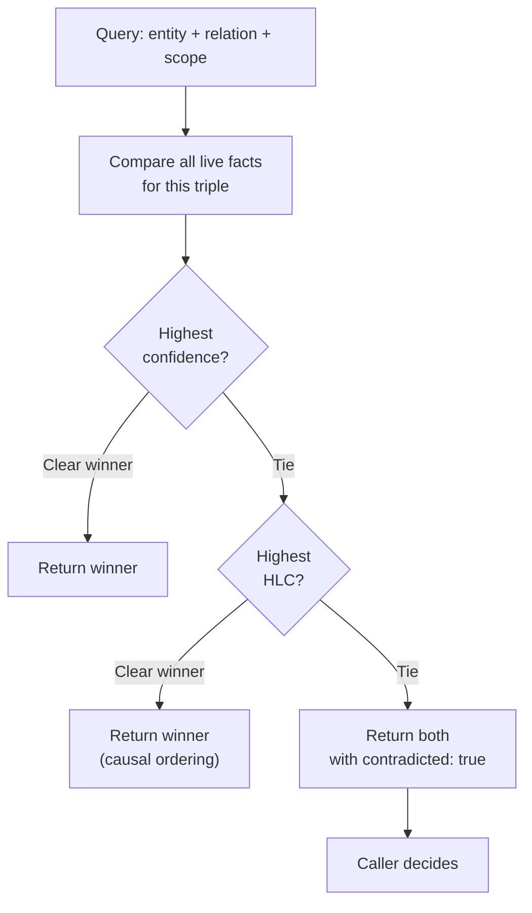
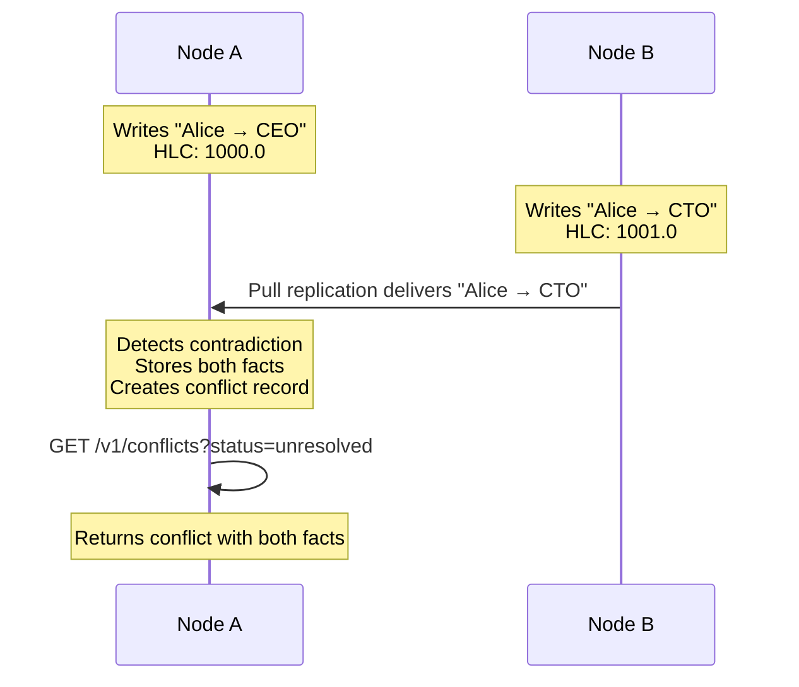

# Conflict Semantics

<p className="stigmem-meta"><span>5 min read</span><span>Protocol implementer · Adapter author · Node operator</span><span>Spec-15-Fact-Semantics</span></p>

<div className="stigmem-lead">

**What this page is**

How Stigmem treats contradictions as first-class facts: both values
stored, neither silently overwritten, a system-generated
contradiction record linking them.

</div>

## The problem

Two sources assert different values for the same thing. Agent A says
Alice's role is "CEO." Agent B says it's "CTO." Both are confident.
Which is right?

In a single-node system, you might impose last-write-wins and move
on. But in a federated network where nodes operate independently
during partitions, two legitimate assertions can arise concurrently
with no causal relationship between them. **Silently picking a winner
means silently losing information** — and in a compliance-sensitive
system, that's unacceptable.

## Naive approaches and why they fail

<div className="stigmem-fields">

<div>
<dt>Approach</dt>
<dt><span className="stigmem-fields__type">Failure mode</span></dt>
<dd>Why it doesn't work</dd>
</div>

<div>
<dt>Last-write-wins (LWW)</dt>
<dt><span className="stigmem-fields__type">silent loss</span></dt>
<dd>The "loser" vanishes without a trace. If both writes happened during a partition, the choice of winner depends on clock accuracy — not correctness. Also prevents you from answering "was there ever a disagreement about this?"</dd>
</div>

<div>
<dt>Operational transforms (OT) or CRDTs</dt>
<dt><span className="stigmem-fields__type">semantic mismatch</span></dt>
<dd>Work well for convergent data types (counters, sets, text), but agent knowledge doesn't fit neatly into CRDT shapes. "Alice is CEO" vs. "Alice is CTO" is not a merge operation — it's a semantic disagreement that requires human or agent judgment.</dd>
</div>

<div>
<dt>Central arbiter</dt>
<dt><span className="stigmem-fields__type">availability and trust asymmetry</span></dt>
<dd>A coordinator node decides all conflicts. Works until the coordinator is unreachable, at which point the entire federation stalls. Why should Node B trust Node A's judgment on a conflict involving Node B's data?</dd>
</div>

</div>

## Our model

Stigmem treats contradictions as **first-class facts**. Both values
are stored. Neither is silently overwritten. A system-generated
contradiction record links them.

### Contradiction detection

A contradiction exists when two facts `a` and `b` satisfy all of:

<div className="stigmem-grid">

<div><h4>Same entity</h4><p><code>a.entity == b.entity</code></p></div>
<div><h4>Same relation</h4><p><code>a.relation == b.relation</code></p></div>
<div><h4>Same scope</h4><p><code>a.scope == b.scope</code></p></div>
<div><h4>Different values</h4><p><code>a.value != b.value</code></p></div>
<div><h4>Both live</h4><p><code>a.confidence &gt; 0.0 && b.confidence &gt; 0.0</code></p></div>

</div>

When detected (at write time, including federated ingest), the node
asserts a contradiction record:

```json
{
  "entity":   "stigmem:conflict:<uuid>",
  "relation": "stigmem:conflict:between",
  "value":    { "type": "text", "v": "<fact-id-a> <fact-id-b>" },
  "source":   "system:stigmem",
  "confidence": 1.0,
  "scope":    "<same scope as the conflicting facts>"
}
```

### Resolution order at query time

When a caller queries for a contradicted entity-relation pair, the
node resolves as follows.



<ol className="stigmem-steps">
<li><strong>Higher confidence wins.</strong> A fact asserted with <code>confidence: 0.95</code> beats one with <code>confidence: 0.7</code>.</li>
<li><strong>Equal confidence → higher HLC wins.</strong> The causally later fact takes precedence.</li>
<li><strong>True tie → both returned.</strong> Each fact is annotated with <code>contradicted: true</code>. The caller (human or agent) must decide.</li>
</ol>

### Explicit resolution

A human or agent resolves a conflict through
`POST /v1/conflicts/:id/resolve`:

```bash
curl -X POST $STIGMEM_URL/v1/conflicts/$CONFLICT_ID/resolve \
  -H "Authorization: Bearer $STIGMEM_API_KEY" \
  -d '{
    "winning_fact_id": "fact_01J...",
    "resolution_note": "Confirmed with Alice: title is CEO as of Q2."
  }'
```

<div className="stigmem-keypoint">

**The resolution is itself a new fact with provenance.**

You can trace who resolved it, when, and why. Both original facts
remain in the store, immutable. The conflict status updates to
<code>"resolved"</code>.

</div>

### Federation and conflicts

Conflicts across federated nodes are expected, not exceptional. When
Node A ingests a fact from Node B that conflicts with a local fact:

<ol className="stigmem-steps">
<li>Both facts are stored.</li>
<li>A contradiction record is generated on the ingesting node.</li>
<li>Both facts are returned to callers with <code>contradicted: true</code>.</li>
<li>Conflict entities (<code>stigmem:conflict:&lt;uuid&gt;</code>) are local — they are never federated (to prevent infinite loops).</li>
</ol>



## Why this is non-obvious

<div className="stigmem-grid">

<div><h4>Storing both sides seems redundant</h4><p>It's not. In a federated system, the "wrong" value on one node may be the "right" value on another — they just haven't reconciled yet. Discarding either side before explicit resolution destroys information that may be needed for compliance, auditing, or debugging.</p></div>
<div><h4>Contradiction records are facts about facts</h4><p>The <code>stigmem:conflict:between</code> entity is itself an immutable fact. You can query, filter, and subscribe to conflicts the same way you query any other fact.</p></div>
<div><h4>Resolution doesn't delete</h4><p>Resolving asserts a <em>new</em> winning fact and marks the conflict as resolved. The original conflicting facts are untouched. You can reconstruct not just what the final answer was, but what the competing values were and who adjudicated.</p></div>
<div><h4>Entity normalization prevents ghost conflicts</h4><p>The strict normalizer (Spec-01-Fact-Model entity normalization) ensures case-variant URIs map to the same canonical form. Before pre-reset, <code>project/EG-18</code> and <code>project/eg-18</code> were treated as different entities — so their conflicting facts would never be detected.</p></div>

</div>

## What it costs

<div className="stigmem-grid">

<div><h4>Storage for conflict records</h4><p>Every contradiction produces at least two additional fact rows (the <code>stigmem:conflict:between</code> and <code>stigmem:conflict:status</code> facts). Overhead is proportional to the number of disagreements.</p></div>
<div><h4>Query latency for contradicted triples</h4><p>Returning two facts instead of one means more data to serialize. The <code>include_contradicted=false</code> default hides this from callers who don't need it.</p></div>
<div><h4>Operator attention</h4><p>Unresolved conflicts accumulate. The lint operation (Spec-20) includes a contradiction check; operators should run it periodically and resolve or escalate stale contradictions.</p></div>
<div><h4>No automatic merge</h4><p>Stigmem never guesses. If two values conflict and neither has higher confidence or a later HLC, the system surfaces the ambiguity rather than inventing a resolution. Correctness over convenience.</p></div>

</div>

## References

<div className="stigmem-next">

<a href="./conflict-resolution">
<strong>Concepts</strong>
<span>Conflict resolution</span>
<small>API reference and worked examples.</small>
</a>

<a href="../federation/federation-trust">
<strong>Concepts</strong>
<span>Federation trust</span>
<small>Cross-node conflict semantics during federation.</small>
</a>

<a href="../../reference/api">
<strong>Reference</strong>
<span>HTTP API</span>
<small>List conflicts and resolve a conflict wire format.</small>
</a>

</div>
