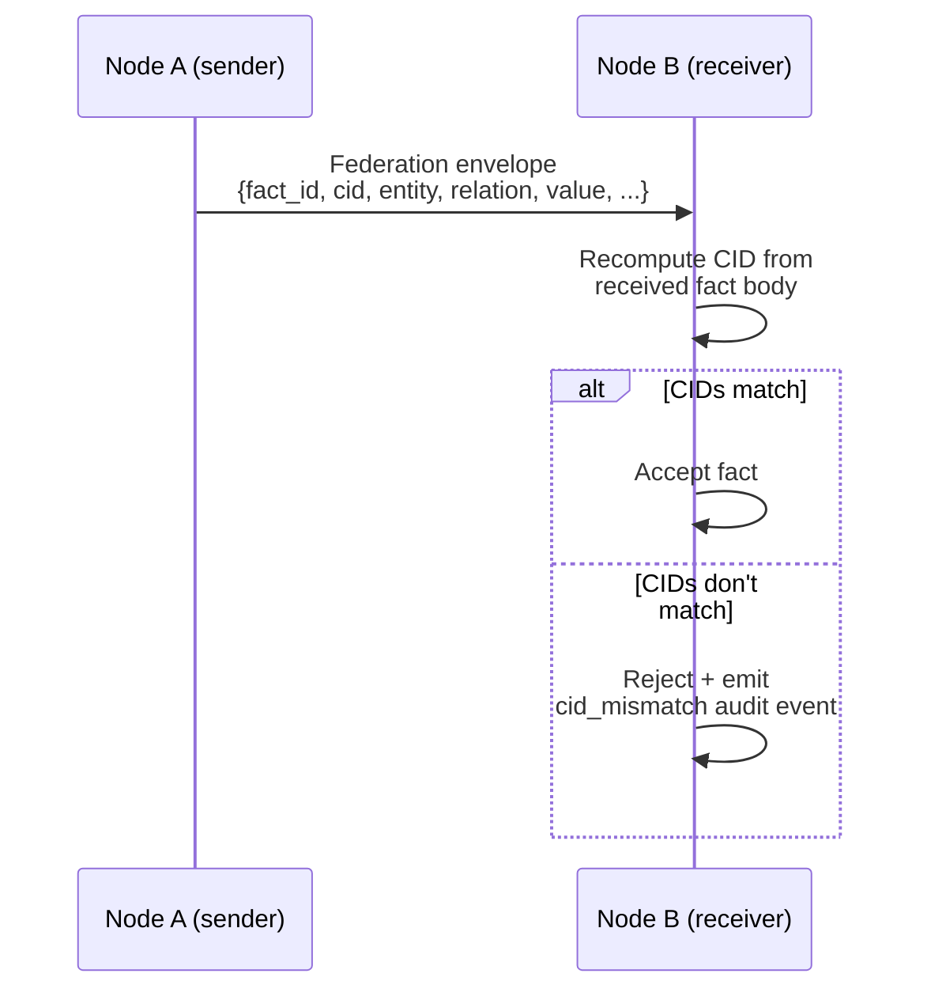

# Content-Addressed Fact IDs

<p className="stigmem-meta"><span>4 min read</span><span>Protocol implementer · Security operator</span><span>Spec-21-Content-Addressed-IDs</span></p>

<div className="stigmem-lead">

**What this page is**

Why Stigmem derives a deterministic SHA-256 identifier (CID) from
each fact's content — and how that enables tamper detection,
federation deduplication, and verifiable provenance linkage. For
practical computation with code samples in Python, TypeScript, and
Go, see [Content Addressing guide](./content-addressing-guide).

</div>

## The problem

Stigmem assigns a random UUID to each fact at write time. That UUID
is opaque — it tells you nothing about the fact's content. If a fact
is modified in transit (e.g., during federation), the UUID doesn't
change. If two nodes independently assert identical facts, they get
different UUIDs. And if a provenance chain references a fact by
UUID, you can't verify the reference without a database lookup.

You need an identifier that is derived from the content itself:
**deterministic, verifiable, and tamper-evident**.

## Naive approaches and why they fail

<div className="stigmem-fields">

<div>
<dt>Approach</dt>
<dt><span className="stigmem-fields__type">Failure mode</span></dt>
<dd>Why it doesn't work</dd>
</div>

<div>
<dt>Hash the entire fact record</dt>
<dt><span className="stigmem-fields__type">metadata sensitivity</span></dt>
<dd>Include every field — timestamps, HLC, garden assignments, trust scores. Now the hash changes when metadata changes, even if the core assertion is identical. Two identical assertions at different times get different hashes. Federation deduplication fails.</dd>
</div>

<div>
<dt>Hash only the value field</dt>
<dt><span className="stigmem-fields__type">too narrow</span></dt>
<dd>Two different entities could assert the same value for different relations. The hash wouldn't distinguish them.</dd>
</div>

<div>
<dt>Use the UUID as a fingerprint</dt>
<dt><span className="stigmem-fields__type">not derivable</span></dt>
<dd>UUIDs are assigned, not derived. You can't recompute a UUID from the fact content. Independent verification impossible — you must trust the issuing node.</dd>
</div>

</div>

## Our model

Stigmem computes a **content-addressed ID (CID)** from a canonical
subset of fact fields using SHA-256:

```
CID = "sha256:" + hex(SHA-256(RFC8785(canonical_body)))
```

The canonical body includes exactly six fields:

```json
{
  "confidence": 0.95,
  "entity":     "stigmem://company.example/user/alice",
  "relation":   "memory:prefers",
  "scope":      "company",
  "source":     "stigmem://company.example/agent/assistant",
  "value":      {"type": "string", "v": "dark mode"}
}
```

<div className="stigmem-keypoint">

**These six fields define *what was asserted, by whom, at what confidence, in what scope*.**

Everything else — timestamps, HLC, garden membership, trust scores,
provenance links — is metadata about the assertion, not the
assertion itself.

</div>

### Canonical encoding

The canonical body is serialized using **RFC 8785 (JSON
Canonicalization Scheme)**: deterministic key ordering, no
whitespace, UTF-8. This ensures that any implementation computing
the CID from the same six fields produces the same bytes, and
therefore the same hash.

The `"sha256:"` prefix enables future hash-algorithm rotation (e.g.,
`"sha3-256:"`) following the dual-trust rollover pattern from
Spec-10-Hardening.

### Worked example · computing a CID

```python
import hashlib
import json

fact_body = {
    "confidence": 0.95,
    "entity": "stigmem://company.example/user/alice",
    "relation": "memory:prefers",
    "scope": "company",
    "source": "stigmem://company.example/agent/assistant",
    "value": {"type": "string", "v": "dark mode"}
}

canonical = json.dumps(fact_body, sort_keys=True, separators=(",", ":"))
digest = hashlib.sha256(canonical.encode("utf-8")).hexdigest()
cid = f"sha256:{digest}"
# cid = "sha256:4e9a2c1f..." (64 hex chars)
```

### Federation tamper detection

When a fact is replicated between nodes, the federation envelope
carries both the legacy `fact_id` (UUID) and the `cid`.



The receiving node independently computes the CID from the inbound
fact body. If it doesn't match the declared `cid`, the fact has been
tampered with in transit and is rejected.

### Deduplication

Identical assertions from different federation sources share the
same CID. If Node A and Node B both assert the same fact (same six
fields), they produce the same CID. The receiving node can detect
this and avoid creating duplicates, even though the `fact_id` UUIDs
are different.

### Dual addressing during migration

The CID is introduced alongside the existing UUID system. During a
12-month migration window, both `fact_id` and `cid` are accepted as
addressing keys.

```bash
# Lookup by UUID (legacy)
curl $STIGMEM_URL/v1/facts/fact_01J...

# Lookup by CID (new)
curl $STIGMEM_URL/v1/facts/sha256:4e9a2c1f...

# Verify CID integrity
curl -X POST $STIGMEM_URL/v1/facts/fact_01J.../verify-cid
# → {"cid_valid": true, "computed_cid": "sha256:...", "stored_cid": "sha256:..."}
```

Existing pre-CID facts have `cid: null` until the backfill migration
runs. New facts are always written with a CID.

## Why this is non-obvious

<div className="stigmem-grid">

<div><h4>Excluding timestamps is deliberate</h4><p>The same assertion made at two different times should have the same CID — it's the same knowledge claim. Including timestamps would make every assertion unique, defeating deduplication and making provenance linkage brittle.</p></div>
<div><h4>Excluding <code>derived_from</code> prevents circularity</h4><p>If CID computation included <code>derived_from</code> (which references other fact CIDs), you'd need to know all ancestor CIDs before computing the current CID — and adding a new derivation link would change the CID. Excluding it keeps CID computation O(1) and non-recursive.</p></div>
<div><h4>Some excluded fields are security-relevant</h4><p><code>valid_until</code>, <code>derived_from</code>, <code>attestation_chain</code>, and <code>source_trust</code> are excluded from the CID but still need independent validation. A malicious peer could modify <code>valid_until</code> to extend a fact's lifetime without changing its CID.</p></div>
<div><h4>The <code>"sha256:"</code> prefix looks redundant today</h4><p>It exists for algorithm agility. If SHA-256 is ever deprecated, nodes can introduce <code>"sha3-256:"</code> and run a dual-trust transition period where both are accepted. Without the prefix, you'd need a flag day where all nodes switch simultaneously.</p></div>

</div>

## What it costs

<div className="stigmem-grid">

<div><h4>Compute overhead</h4><p>One SHA-256 hash per fact write. Negligible on modern hardware (~200ns per hash).</p></div>
<div><h4>Storage</h4><p>A 71-character CID string (<code>"sha256:" + 64 hex chars</code>) per fact, plus a row in the <code>fact_cid_aliases</code> table. Modest overhead.</p></div>
<div><h4>Migration effort</h4><p>Existing facts need a backfill (<code>stigmem backfill-cids</code> CLI). For large fact stores, this runs in batches of 1,000 with configurable rate limiting. Idempotent and can run concurrently with live writes.</p></div>
<div><h4>Hash collision risk</h4><p>SHA-256 has 2^128 collision resistance. A collision means two different facts produce the same CID. The node handles this by comparing the full fact body on collision and rejecting the second fact if bodies differ. Will never occur at knowledge-fabric scale.</p></div>

</div>

## References

<div className="stigmem-next">

<a href="./content-addressing-guide">
<strong>Concepts</strong>
<span>Content Addressing guide</span>
<small>Practical computation with Python, TypeScript, and Go code samples.</small>
</a>

<a href="https://github.com/eidetic-labs/stigmem/blob/main/spec/stigmem-spec-v0.9.0a1.md">
<strong>Spec-21-Content-Addressed-IDs</strong>
<span>Full CID protocol</span>
<small>Format, federation envelope extensions, migration procedure.</small>
</a>

<a href="../federation/federation-trust">
<strong>Concepts</strong>
<span>Federation trust</span>
<small>How CIDs anchor cross-org integrity verification.</small>
</a>

</div>
