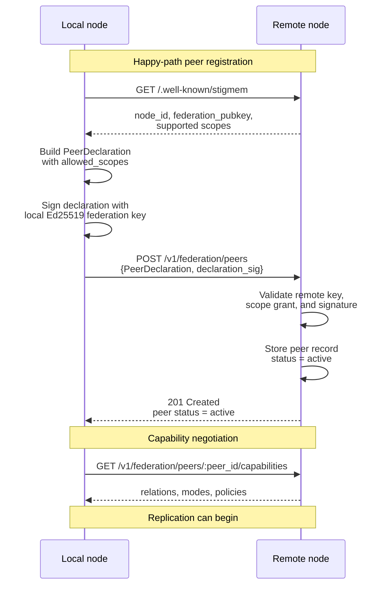

# Federation Handshake

<p className="stigmem-meta"><span>4 min read</span><span>Node operator · Protocol implementer</span><span>Spec-05-Federation-Trust</span></p>

<div className="stigmem-lead">

**What this page is**

How two Stigmem nodes run by different organizations establish
bilateral trust, exchange capability advertisements, and begin
replicating facts — a three-phase protocol with cryptographic
guarantees and no central authority.

</div>

## The problem

Two Stigmem nodes run by different organizations want to share
knowledge. But sharing means trusting: trusting that the other node
won't inject malicious facts, won't escalate scope boundaries, won't
replay old tokens, and won't forge provenance. You need a handshake
protocol that establishes bilateral trust with cryptographic
guarantees — **without requiring a central authority**.

## Naive approaches and why they fail

<div className="stigmem-fields">

<div>
<dt>Approach</dt>
<dt><span className="stigmem-fields__type">Failure mode</span></dt>
<dd>Why it doesn't work</dd>
</div>

<div>
<dt>Shared API key</dt>
<dt><span className="stigmem-fields__type">blast radius</span></dt>
<dd>Both nodes use the same credential. If one is compromised, both are. No way to restrict what the peer can do (read vs. write, which scopes) or to revoke access without rotating the key on both sides. No replay protection.</dd>
</div>

<div>
<dt>OAuth / JWT with central IdP</dt>
<dt><span className="stigmem-fields__type">single point of failure</span></dt>
<dd>Requires a trusted third party to issue tokens. In a federated network where each node is independently operated, there may be no shared IdP. Even if there is, the central authority becomes a single point of failure and a trust bottleneck.</dd>
</div>

<div>
<dt>Mutual TLS only</dt>
<dt><span className="stigmem-fields__type">missing authorization</span></dt>
<dd>mTLS authenticates the transport but doesn't express authorization. Knowing <em>who</em> the peer is doesn't tell you <em>what</em> they're allowed to do.</dd>
</div>

</div>

## Our model

Stigmem's federation handshake is a three-phase protocol: **peer
declaration**, **verification**, and **capability negotiation**. The
registration contract is defined in Spec-05-Federation-Trust.



### Peer declaration

Node A sends a signed `PeerDeclaration` to Node B:

```json
{
  "node_url":          "https://node-a.example.com",
  "node_id":           "stigmem://node-a.example.com",
  "federation_pubkey": "<base64url Ed25519 public key>",
  "allowed_scopes":    ["public"],
  "declaration_sig":   "<Ed25519 sig over canonical JSON>",
  "signed_at":         "2026-05-01T00:00:00Z"
}
```

The `allowed_scopes` array is the authorization grant: Node A is
willing to share `public`-scoped facts with Node B. The signature
proves that Node A (holder of the private key) issued this
declaration.

### Verification

Node B fetches Node A's `/.well-known/stigmem` to retrieve the
published `federation_pubkey`. It verifies `declaration_sig` against
that key. If the key in the declaration doesn't match the published
key, the peer is rejected — this prevents a third party from forging
declarations.

<div className="stigmem-keypoint">

**Mutual federation requires both sides to complete this handshake.**

Replication does not begin until both peers are <code>"active"</code>.

</div>

### Capability negotiation

After verification, nodes exchange capability advertisements:

```json
{
  "relations_understood":    ["memory:", "intent:", "roadmap:"],
  "federation_mode":         "pull",
  "pull_interval_s":         30,
  "contradiction_overrides": [
    { "relation": "roadmap:status", "policy": "latest" }
  ]
}
```

This tells each side what relations the peer understands, preventing
silent contradiction storms on semantically opaque relations.

### Replication

Once active, the subscriber pulls facts from the publisher using
short-lived Ed25519-signed **peer tokens**.

```
PeerToken {
  iss:    "stigmem://node-a.example.com",
  sub:    "stigmem://node-b.example.com",
  exp:    <iat + 3600s max>,
  nonce:  <UUID>,
  scopes: ["public"]
}
```

Tokens have a 1-hour maximum lifetime and carry a nonce for replay
protection. The receiving node verifies the signature, checks the
nonce cache, and validates the `scopes` claim against the
PeerDeclaration. The pull loop runs every 30 seconds by default,
using an HLC-based cursor for incremental replication.

### Scope enforcement

Scope boundaries are enforced per-hop with a two-factor check:
`fact.scope ∈ allowed_scopes(PeerDeclaration) ∩ token.scopes`. A fact
is only federated if both the declaration and the token permit it.

<div className="stigmem-fields">

<div>
<dt>Fact scope</dt>
<dt><span className="stigmem-fields__type">Federatable?</span></dt>
<dd>Conditions</dd>
</div>

<div>
<dt><code>local</code></dt>
<dt><span className="stigmem-fields__type">Never</span></dt>
<dd></dd>
</div>

<div>
<dt><code>team</code></dt>
<dt><span className="stigmem-fields__type">Never (unless explicit operator override)</span></dt>
<dd></dd>
</div>

<div>
<dt><code>company</code></dt>
<dt><span className="stigmem-fields__type">Only if PeerDeclaration includes <code>"company"</code></span></dt>
<dd>Re-federation to third nodes is blocked by default (Spec-05-Federation-Trust scope-propagation invariants).</dd>
</div>

<div>
<dt><code>public</code></dt>
<dt><span className="stigmem-fields__type">Yes, to any active peer</span></dt>
<dd></dd>
</div>

</div>

## Why this is non-obvious

<div className="stigmem-grid">

<div><h4>Bilateral, not unilateral</h4><p>Both nodes must independently register and verify. Node A's declaration to Node B doesn't grant Node B any access to Node A — B must also send a declaration, and A must verify it.</p></div>
<div><h4>Company-scoped facts don't cascade</h4><p>A company-scoped fact shared with Peer B is <em>not</em> automatically shareable by B with Peer C. The originating node's grant is non-transitive. Prevents a relay node with broader permissions from leaking internal knowledge.</p></div>
<div><h4>Capability negotiation is required</h4><p>Without it, a peer might replicate relations it doesn't understand (e.g., <code>paperclip:</code> lifecycle facts), leading to contradiction storms on semantically opaque data.</p></div>
<div><h4>Pull-based default is deliberate</h4><p>Push would be lower latency, but pull is operationally simpler: the subscriber controls cadence, backpressure is built in (429 → exponential backoff), and there's no need for the publisher to maintain push delivery state.</p></div>

</div>

## What it costs

<div className="stigmem-grid">

<div><h4>Operational overhead</h4><p>Each federation relationship requires a key exchange, mutual registration, and ongoing monitoring. For N nodes in a full mesh, that's N×(N-1) peer declarations.</p></div>
<div><h4>Replication lag</h4><p>Pull-based replication introduces a lag proportional to <code>pull_interval_s</code> (default 30 seconds). Relay nodes in multi-hop topologies can compound this lag.</p></div>
<div><h4>Key rotation coordination</h4><p>When a node rotates its federation keypair, it must keep the old key active for 24 hours. Peers re-fetch <code>/.well-known/stigmem</code>, but a race window exists during the transition.</p></div>
<div><h4>No gossip protocol</h4><p>Pairwise peer declarations, not gossip. Adding a new node to a 10-node network requires 10 separate handshakes. Linear, not logarithmic — acceptable for small-to-medium federations.</p></div>

</div>

## References

<div className="stigmem-next">

<a href="./federation-trust">
<strong>Concepts</strong>
<span>Federation trust</span>
<small>Operator setup end-to-end.</small>
</a>

<a href="./scope-propagation">
<strong>Concepts</strong>
<span>Scope propagation</span>
<small>How scope is enforced at each relay hop.</small>
</a>

<a href="./source-trust-and-quarantine">
<strong>Concepts</strong>
<span>Source trust & quarantine</span>
<small>How fact sources earn trust at recall time.</small>
</a>

<a href="https://github.com/eidetic-labs/stigmem/blob/main/spec/stigmem-spec-v0.9.0a1.md">
<strong>Spec-05</strong>
<span>Federation Trust protocol</span>
<small>PeerDeclaration shape, capability negotiation, security invariants.</small>
</a>

</div>
