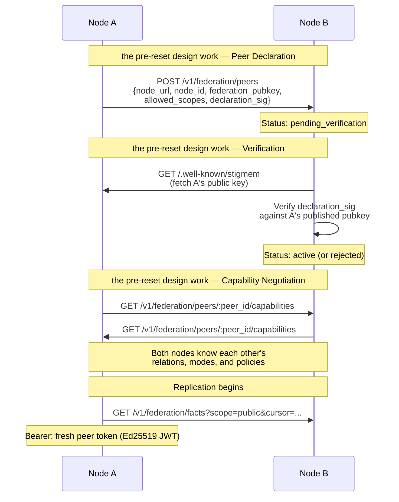

# Federation Handshake

**Audience:** Node operators and protocol implementers.

## The problem

Two Stigmem nodes run by different organizations want to share knowledge. But sharing means trusting: trusting that the other node won't inject malicious facts, won't escalate scope boundaries, won't replay old tokens, and won't forge provenance. You need a handshake protocol that establishes bilateral trust with cryptographic guarantees — without requiring a central authority.

## Naive approaches and why they fail

**Shared API key.** Both nodes use the same credential. If one is compromised, both are. There's no way to restrict what the peer can do (read vs. write, which scopes) or to revoke access without rotating the key on both sides. No replay protection.

**OAuth / JWT with central IdP.** Requires a trusted third party to issue tokens. In a federated network where each node is independently operated, there may be no shared IdP. Even if there is, the central authority becomes a single point of failure and a trust bottleneck.

**Mutual TLS only.** mTLS authenticates the transport but doesn't express authorization. Knowing *who* the peer is doesn't tell you *what* they're allowed to do. You still need an authorization layer on top.

## Our model

Stigmem's federation handshake is a three-phase protocol: **peer declaration**, **verification**, and **capability negotiation**.



### the pre-reset design work — Peer Declaration

Node A sends a signed `PeerDeclaration` to Node B:

```json
{
  "node_url":          "https://node-a.example.com",
  "node_id":           "stigmem://node-a.example.com",
  "federation_pubkey": "<base64url Ed25519 public key>",
  "allowed_scopes":    ["public"],
  "declaration_sig":   "<Ed25519 sig over canonical JSON>",
  "signed_at":         "2026-05-01T00:00:00Z"
}
```

The `allowed_scopes` array is the authorization grant: Node A is willing to share `public`-scoped facts with Node B. The signature proves that Node A (holder of the private key) issued this declaration.

### the pre-reset design work — Verification

Node B fetches Node A's `/.well-known/stigmem` to retrieve the published `federation_pubkey`. It verifies `declaration_sig` against that key. If the key in the declaration doesn't match the published key, the peer is rejected — this prevents a third party from forging declarations.

Mutual federation requires both sides to complete this handshake. Replication does not begin until both peers are `"active"`.

### the pre-reset design work — Capability Negotiation

After verification, nodes exchange capability advertisements:

```json
{
  "relations_understood":    ["memory:", "intent:", "roadmap:"],
  "federation_mode":         "pull",
  "pull_interval_s":         30,
  "contradiction_overrides": [
    { "relation": "roadmap:status", "policy": "latest" }
  ]
}
```

This tells each side what relations the peer understands, preventing silent contradiction storms on semantically opaque relations.

### Replication

Once active, the subscriber pulls facts from the publisher using short-lived Ed25519-signed **peer tokens**:

```
PeerToken {
  iss:    "stigmem://node-a.example.com",
  sub:    "stigmem://node-b.example.com",
  exp:    <iat + 3600s max>,
  nonce:  <UUID>,
  scopes: ["public"]
}
```

Tokens have a 1-hour maximum lifetime and carry a nonce for replay protection. The receiving node verifies the signature, checks the nonce cache, and validates the `scopes` claim against the PeerDeclaration. The pull loop runs every 30 seconds by default, using an HLC-based cursor for incremental replication.

### Scope enforcement

Scope boundaries are enforced per-hop with a two-factor check: `fact.scope ∈ allowed_scopes(PeerDeclaration) ∩ token.scopes`. A fact is only federated if both the declaration and the token permit it.

| Fact scope | Federatable? |
|---|---|
| `local` | Never |
| `team` | Never (unless explicit operator override) |
| `company` | Only if PeerDeclaration includes `"company"` — and re-federation to third nodes is blocked by default (spec §6.8.2) |
| `public` | Yes, to any active peer |

## Why this is non-obvious

**Bilateral, not unilateral.** Both nodes must independently register and verify. Node A's declaration to Node B doesn't grant Node B any access to Node A — B must also send a declaration, and A must verify it. This prevents asymmetric trust assumptions.

**Company-scoped facts don't cascade.** A company-scoped fact shared with Peer B is *not* automatically shareable by B with Peer C. The originating node's grant is non-transitive (spec §6.8.2). This prevents a relay node with broader permissions from leaking internal knowledge to third parties.

**Capability negotiation is required.** Without it, a peer might replicate relations it doesn't understand (e.g., `paperclip:` lifecycle facts), leading to contradiction storms on semantically opaque data. The capability advertisement makes replication intent-aware.

**The pull-based default is deliberate.** Push would be lower latency, but pull is operationally simpler: the subscriber controls the cadence, backpressure is built in (429 → exponential backoff), and there's no need for the publisher to maintain push delivery state. Push is available as an opt-in for latency-sensitive deployments.

## What it costs

- **Operational overhead.** Each federation relationship requires a key exchange, mutual registration, and ongoing monitoring. For N nodes in a full mesh, that's N×(N-1) peer declarations.
- **Replication lag.** Pull-based replication introduces a lag proportional to `pull_interval_s` (default 30 seconds). Relay nodes in multi-hop topologies can compound this lag (spec §6.7).
- **Key rotation coordination.** When a node rotates its federation keypair, it must keep the old key active for 24 hours. Peers that fail verification re-fetch `/.well-known/stigmem`, but a race window exists during the transition.
- **No gossip protocol.** Stigmem uses pairwise peer declarations, not gossip. Adding a new node to a 10-node network requires 10 separate handshakes. This scales linearly, not logarithmically — acceptable for small-to-medium federations but a cost at large scale.

## References

- Spec §6.1 — PeerDeclaration shape and signing
- Spec §6.2 — Capability negotiation (required as of pre-reset)
- Spec §6.3 — Replication protocol (pull cadence, idempotent ingestion, HLC sync)
- Spec §6.4 — Scope enforcement per-hop
- Spec §6.6 — Security invariants (non-escalation, non-forgery, replay resistance, partition safety)
- Spec §6.7 — N-node backpressure patterns
- Spec §6.8 — Scope propagation invariants and re-federation restrictions
