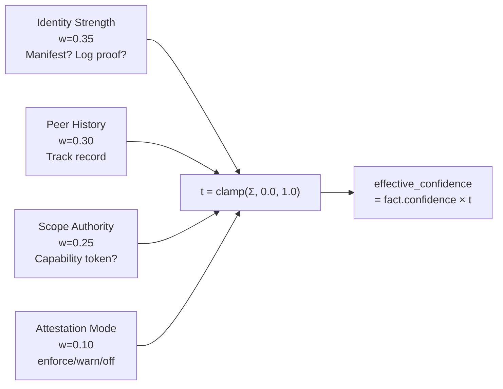
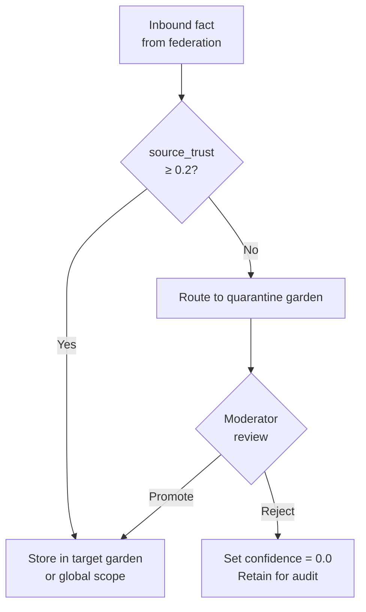

# Source Trust and Quarantine

<p className="stigmem-meta"><span>4 min read</span><span>Node operator · Security implementer</span><span>Spec-05-Federation-Trust.4–.5</span></p>

<div className="stigmem-lead">

**What this page is**

How Stigmem modulates effective confidence at recall time based on
*who said it* (not just *how confident they claim to be*), and how
facts that fall below the trust threshold land in a quarantine
garden for human review.

</div>

## The problem

Not all fact sources are equally trustworthy. A verified internal
agent with a signed org manifest is more reliable than an anonymous
external adapter that just started writing. But Stigmem's fact model
treats every fact's `confidence` field as the asserter's
self-reported certainty — **a malicious or misconfigured source can
claim `confidence: 1.0` on garbage data**.

You need a way to modulate effective confidence based on *who said
it*, not just *how confident they claim to be*.

## Naive approaches and why they fail

<div className="stigmem-fields">

<div>
<dt>Approach</dt>
<dt><span className="stigmem-fields__type">Failure mode</span></dt>
<dd>Why it doesn't work</dd>
</div>

<div>
<dt>Binary allow/deny lists</dt>
<dt><span className="stigmem-fields__type">no middle ground</span></dt>
<dd>Either a source is trusted (all facts accepted) or blocked (all facts rejected). No room for new sources, probationary contributors, or sources whose trustworthiness varies over time.</dd>
</div>

<div>
<dt>Manual review of every inbound fact</dt>
<dt><span className="stigmem-fields__type">doesn't scale</span></dt>
<dd>Secure but unscalable. A busy federation can produce thousands of facts per hour. Human review becomes a bottleneck.</dd>
</div>

<div>
<dt>Trust the federation peer, not the source</dt>
<dt><span className="stigmem-fields__type">no source granularity</span></dt>
<dd>If Node B is trusted, all facts from Node B are trusted. But Node B might be relaying facts from Node C, which is compromised. Peer-level trust doesn't give you source-level granularity.</dd>
</div>

</div>

## Our model

Stigmem's source-trust model has three layers: a **trust score**
computed per source, an **effective confidence** multiplier applied
at recall time, and a **quarantine garden** for facts that fail
trust thresholds.

### Trust score computation

The trust score `t` for a source is a weighted sum of four
components:



<div className="stigmem-fields">

<div>
<dt>Component</dt>
<dt><span className="stigmem-fields__type">Weight</span></dt>
<dd>What it measures</dd>
</div>

<div>
<dt><code>identity_strength</code></dt>
<dt><span className="stigmem-fields__type">0.35</span></dt>
<dd>How strongly is this source identified? (Org manifest with log proof → 1.0; unrecognized → 0.1)</dd>
</div>

<div>
<dt><code>peer_history</code></dt>
<dt><span className="stigmem-fields__type">0.30</span></dt>
<dd>Track record: ≥100 facts with 0 attestation failures → 1.0; new source → 0.5.</dd>
</div>

<div>
<dt><code>scope_authority</code></dt>
<dt><span className="stigmem-fields__type">0.25</span></dt>
<dd>Does this source have a capability token for this scope?</dd>
</div>

<div>
<dt><code>attestation_mode</code></dt>
<dt><span className="stigmem-fields__type">0.10</span></dt>
<dd>Is the node running in <code>enforce</code>, <code>warn</code>, or <code>off</code> mode?</dd>
</div>

</div>

A source with no computable score defaults to `t = 0.5`. Admin-blocklisted
sources get `t = 0.0` regardless.

### Effective confidence

At recall time, stored confidence is multiplied by the live trust
score:

```
effective_confidence = fact.confidence × t(fact.source)
```

<div className="stigmem-keypoint">

**The trust score is recomputed at recall time from current peer state — not from the stored `source_trust` snapshot.**

A source whose trust improves (e.g., by publishing an org manifest)
retroactively improves the effective confidence of all its past
facts, without rewriting any stored data.

</div>

### Trust modes

Operators configure how aggressively the node enforces trust.

<div className="stigmem-fields">

<div>
<dt>Mode</dt>
<dt><span className="stigmem-fields__type">Posture</span></dt>
<dd>Behavior</dd>
</div>

<div>
<dt><code>strict</code></dt>
<dt><span className="stigmem-fields__type">enforced</span></dt>
<dd>Log proofs required for peer manifests. Facts from sources with <code>t &lt; 0.2</code> are quarantined.</dd>
</div>

<div>
<dt><code>relaxed</code> (default)</dt>
<dt><span className="stigmem-fields__type">observed</span></dt>
<dd>Trust scores computed but not enforced. Attestation failures are logged.</dd>
</div>

<div>
<dt><code>off</code></dt>
<dt><span className="stigmem-fields__type">disabled</span></dt>
<dd>No trust computation. <code>source_trust</code> is null on all facts.</dd>
</div>

</div>

### Quarantine garden

When a fact fails trust requirements in `strict` mode, it's routed
to a **quarantine garden** — a special-purpose Memory Garden
(Spec-02-Scopes-and-ACL) that isolates untrusted facts pending human
review.



Facts enter quarantine when:

<ol className="stigmem-steps">
<li>The source's trust score <code>t &lt; 0.2</code>, OR</li>
<li>The source lacks a valid org manifest, OR</li>
<li>The fact fails provenance chain verification (Spec-05-Federation-Trust provenance-chain validation).</li>
</ol>

A `quarantine:moderator` reviews and either **promotes** (moves the
fact to a target garden) or **rejects** (retracts the fact). Both
actions are logged to the attestation audit trail.

### Worked example · quarantine flow

```bash
# Check if a fact is from a quarantined source
curl $STIGMEM_URL/v1/gardens/quarantine-default/members \
  -H "Authorization: Bearer $STIGMEM_API_KEY"

# Promote a reviewed fact to the production scope
curl -X POST $STIGMEM_URL/v1/gardens/quarantine-default/promote \
  -H "Authorization: Bearer $STIGMEM_API_KEY" \
  -d '{
    "fact_id": "fact_01J...",
    "target_garden_id": null,
    "reason": "Verified provenance via transparency log."
  }'
# → 200 { "promoted_at": "2026-05-04T12:00:00Z", ... }

# Reject a suspicious fact
curl -X POST $STIGMEM_URL/v1/gardens/quarantine-default/reject \
  -d '{
    "fact_id": "fact_02J...",
    "reason": "Failed source attestation; untrusted origin."
  }'
# → 200 { "rejected_at": "2026-05-04T12:01:00Z", ... }
```

## Why this is non-obvious

<div className="stigmem-grid">

<div><h4>Trust modulates confidence, not visibility</h4><p>A fact from a low-trust source isn't hidden — it's <em>downweighted</em>. Recall results naturally prefer facts from trusted sources without requiring hard filters that might discard useful information.</p></div>
<div><h4>Recomputation at recall time is intentional</h4><p>Storing a trust score at write time would freeze it. Sources evolve: a new adapter gains trust as it accumulates attestation-clean history. Recomputing <code>t</code> live means the knowledge graph's trust landscape updates continuously.</p></div>
<div><h4>Quarantine is a garden, not a jail</h4><p>Quarantine uses the same Memory Garden machinery (ACLs, scoping, membership) as any other garden. A quarantined fact is a normal fact in a special-purpose garden — it's not in a separate data path.</p></div>
<div><h4>Strict mode is opt-in</h4><p>The default (<code>relaxed</code>) computes scores but doesn't block anything. Lets operators observe the trust distribution before turning on enforcement — crucial for production rollouts where false positives would disrupt operations.</p></div>

</div>

## What it costs

<div className="stigmem-grid">

<div><h4>Computation per recall</h4><p>Trust scores are recomputed live. For each distinct source in a recall result set, the node evaluates four components. With caching (60-second TTL), overhead is bounded by distinct sources, not facts.</p></div>
<div><h4>Moderator toil</h4><p>Quarantine in <code>strict</code> mode requires someone to review and promote or reject facts. Size your moderator team relative to expected untrusted inbound volume.</p></div>
<div><h4>Policy complexity</h4><p>The four-weight formula with configurable per-component values can be difficult to tune. Start with defaults and adjust based on observed trust distributions.</p></div>
<div><h4>False quarantines</h4><p>A legitimate source without an org manifest will have a low identity strength score. In <code>strict</code> mode, its facts are quarantined even if correct. Ensure all trusted sources publish manifests before enabling <code>strict</code>.</p></div>

</div>

## References

<div className="stigmem-next">

<a href="./federation-trust">
<strong>Concepts</strong>
<span>Federation trust</span>
<small>The operator runbook end-to-end.</small>
</a>

<a href="../security-model">
<strong>Concepts</strong>
<span>Security model</span>
<small>Source attestation and capability tokens.</small>
</a>

<a href="https://github.com/eidetic-labs/stigmem/blob/main/spec/stigmem-spec-v0.9.0a1.md">
<strong>Spec-05.4–.5</strong>
<span>Trust score + quarantine</span>
<small>Formula, mode configuration, recall multiplier, quarantine semantics.</small>
</a>

</div>
