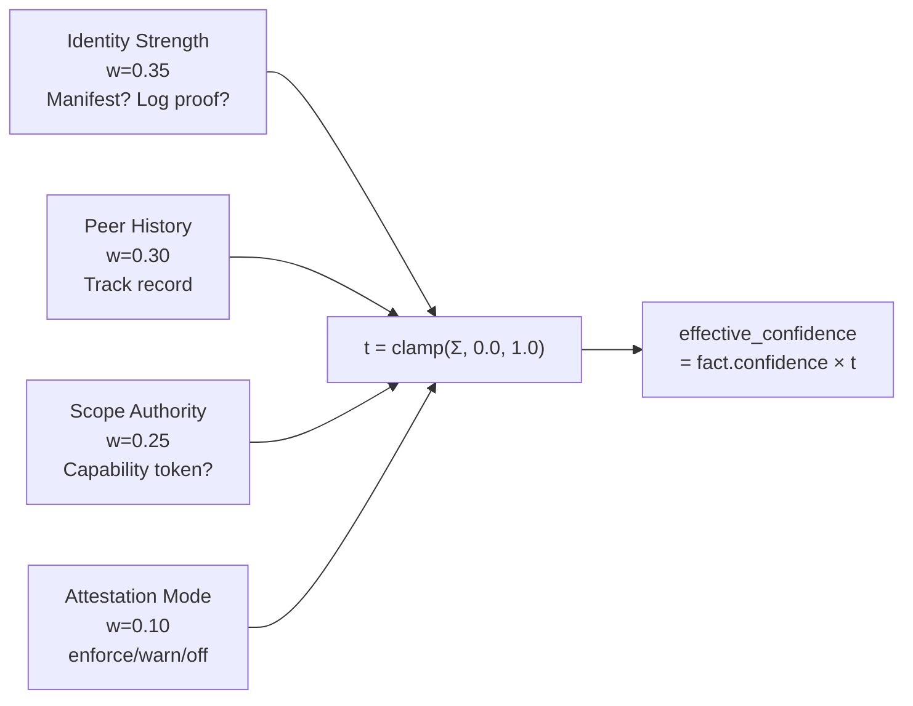
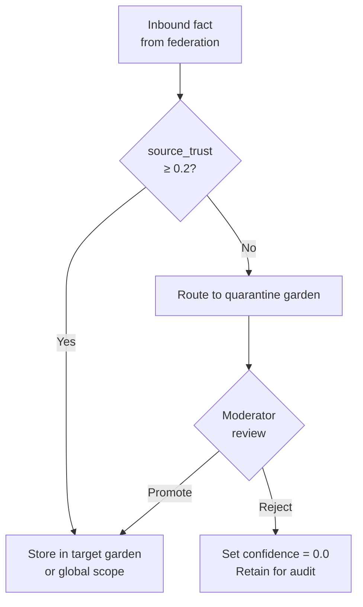

# Source Trust and Quarantine

**Audience:** Node operators and security-focused implementers.

## The problem

Not all fact sources are equally trustworthy. A verified internal agent with a signed org manifest is more reliable than an anonymous external adapter that just started writing. But Stigmem's fact model treats every fact's `confidence` field as the asserter's self-reported certainty — a malicious or misconfigured source can claim `confidence: 1.0` on garbage data.

You need a way to modulate effective confidence based on *who said it*, not just *how confident they claim to be*.

## Naive approaches and why they fail

**Binary allow/deny lists.** Either a source is trusted (all facts accepted) or blocked (all facts rejected). This gives you no middle ground for new sources, probationary contributors, or sources whose trustworthiness varies over time.

**Manual review of every inbound fact.** Secure but unscalable. A busy federation can produce thousands of facts per hour. Human review becomes a bottleneck that defeats the purpose of automated knowledge sharing.

**Trust the federation peer, not the source.** If Node B is trusted, all facts from Node B are trusted. But Node B might be relaying facts from Node C, which is compromised. Peer-level trust doesn't give you source-level granularity.

## Our model

Stigmem's source-trust model has three layers: a **trust score** computed per source, an **effective confidence** multiplier applied at recall time, and a **quarantine garden** for facts that fail trust thresholds.

### Trust score computation

The trust score `t` for a source is a weighted sum of four components:



| Component | Weight | What it measures |
|---|---|---|
| `identity_strength` | 0.35 | How strongly is this source identified? (Org manifest with log proof → 1.0; unrecognized → 0.1) |
| `peer_history` | 0.30 | Track record: ≥100 facts with 0 attestation failures → 1.0; new source → 0.5 |
| `scope_authority` | 0.25 | Does this source have a capability token for this scope? |
| `attestation_mode` | 0.10 | Is the node running in `enforce`, `warn`, or `off` mode? |

A source with no computable score defaults to `t = 0.5`. Admin-blocklisted sources get `t = 0.0` regardless.

### Effective confidence

At recall time, stored confidence is multiplied by the live trust score:

```
effective_confidence = fact.confidence × t(fact.source)
```

The trust score is **recomputed at recall time** from current peer state — not from the stored `source_trust` snapshot. This means a source whose trust improves (e.g., by publishing an org manifest) retroactively improves the effective confidence of all its past facts, without rewriting any stored data.

### Trust modes

Operators configure how aggressively the node enforces trust:

| Mode | Behavior |
|---|---|
| `strict` | Log proofs required for peer manifests. Facts from sources with `t < 0.2` are quarantined. |
| `relaxed` (default) | Trust scores computed but not enforced. Attestation failures are logged. |
| `off` | No trust computation. `source_trust` is null on all facts. |

### Quarantine garden

When a fact fails trust requirements in `strict` mode, it's routed to a **quarantine garden** — a special-purpose Memory Garden (Spec-02-Scopes-and-ACL) that isolates untrusted facts pending human review.



Facts enter quarantine when:
1. The source's trust score `t < 0.2`, OR
2. The source lacks a valid org manifest, OR
3. The fact fails provenance chain verification (Spec-05-Federation-Trust provenance-chain validation)

A `quarantine:moderator` reviews and either **promotes** (moves the fact to a target garden) or **rejects** (retracts the fact). Both actions are logged to the attestation audit trail.

### Worked example: quarantine flow

```bash
# Check if a fact is from a quarantined source
curl $STIGMEM_URL/v1/gardens/quarantine-default/members \
  -H "Authorization: Bearer $STIGMEM_API_KEY"

# Promote a reviewed fact to the production scope
curl -X POST $STIGMEM_URL/v1/gardens/quarantine-default/promote \
  -H "Authorization: Bearer $STIGMEM_API_KEY" \
  -d '{
    "fact_id": "fact_01J...",
    "target_garden_id": null,
    "reason": "Verified provenance via transparency log."
  }'
# → 200 { "promoted_at": "2026-05-04T12:00:00Z", ... }

# Reject a suspicious fact
curl -X POST $STIGMEM_URL/v1/gardens/quarantine-default/reject \
  -d '{
    "fact_id": "fact_02J...",
    "reason": "Failed source attestation; untrusted origin."
  }'
# → 200 { "rejected_at": "2026-05-04T12:01:00Z", ... }
```

## Why this is non-obvious

**Trust modulates confidence, not visibility.** A fact from a low-trust source isn't hidden — it's *downweighted*. This means recall results naturally prefer facts from trusted sources without requiring hard filters that might discard useful information.

**Recomputation at recall time is intentional.** Storing a trust score at write time would freeze it. Sources evolve: a new adapter gains trust as it accumulates attestation-clean history. Recomputing `t` live means the knowledge graph's trust landscape updates continuously.

**Quarantine is a garden, not a jail.** Quarantine uses the same Memory Garden machinery (ACLs, scoping, membership) as any other garden. A quarantined fact is a normal fact in a special-purpose garden — it's not in a separate data path. This reuse means quarantine gets all the garden features (read access for auditors, garden-filtered queries, federation isolation) without new machinery.

**Strict mode is opt-in.** The default (`relaxed`) computes scores but doesn't block anything. This lets operators observe the trust distribution before turning on enforcement — a crucial property for production rollouts where false positives would disrupt operations.

## What it costs

- **Computation per recall.** Trust scores are recomputed live. For each distinct source in a recall result set, the node evaluates four components. With caching (60-second TTL), the overhead is bounded by the number of distinct sources, not the number of facts.
- **Moderator toil.** Quarantine in `strict` mode requires someone to review and promote or reject facts. Operators should size their moderator team relative to expected untrusted inbound volume.
- **Policy complexity.** The four-weight formula with configurable per-component values can be difficult to tune. Operators should start with defaults and adjust based on observed trust distributions.
- **False quarantines.** A legitimate source without an org manifest will have a low identity strength score. In `strict` mode, its facts are quarantined even if they're correct. Operators should ensure all trusted sources publish manifests before enabling `strict`.

## References

- Spec-05-Federation-Trust.4 — Source-trust score derivation formula and component definitions
- Spec-05-Federation-Trust.4.3 — Trust mode configuration (`strict`, `relaxed`, `off`)
- Spec-05-Federation-Trust.4.4 — Recall-time multiplier
- Spec-05-Federation-Trust.5 — Quarantine garden (purpose, roles, automatic policy, promote/reject)
- Spec-X6-Source-Attestation — Source attestation (binds declared `source` to authenticated `entity_uri`)
- Spec Spec-02-Scopes-and-ACL — Memory Garden (the underlying garden machinery)
- Spec-03-HTTP-API quarantine operations — Quarantine operations wire format (promote, reject)
