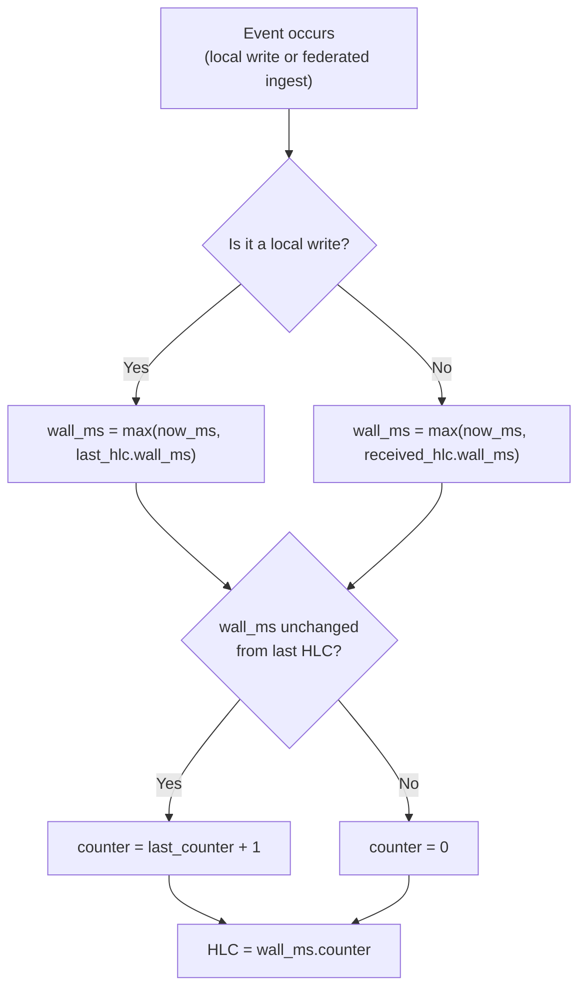

# Hybrid Logical Clocks

<p className="stigmem-meta"><span>4 min read</span><span>Protocol implementer · Node operator</span><span>Spec-01-Fact-Model.4</span></p>

<div className="stigmem-lead">

**What this page is**

How Stigmem orders facts causally across distributed nodes without a
central coordinator — combining wall-clock time with a logical
counter into a single monotone identifier.

</div>

## The problem

Distributed nodes need to agree on the order of events. If Node A
asserts "Alice is CEO" and Node B asserts "Alice is CTO" during a
network partition, which came first? The answer determines which
fact is the latest when the partition heals.

Wall clocks seem like the obvious answer — just compare timestamps.
But wall clocks drift. NTP synchronization has millisecond-level
jitter, VM clocks can jump, and a node whose clock runs fast will
appear to win every conflict. You need a clock that is both causally
correct *and* close to real time.

## Naive approaches and why they fail

<div className="stigmem-fields">

<div>
<dt>Approach</dt>
<dt><span className="stigmem-fields__type">Failure mode</span></dt>
<dd>Why it doesn't work</dd>
</div>

<div>
<dt>Wall clocks alone</dt>
<dt><span className="stigmem-fields__type">silent loss</span></dt>
<dd>Two nodes with clocks 50ms apart will disagree on ordering for any events within that window. A clock that jumps backward (e.g., NTP correction) can cause a fact written later to appear older than one written earlier.</dd>
</div>

<div>
<dt>Pure logical clocks (Lamport)</dt>
<dt><span className="stigmem-fields__type">opaque counter</span></dt>
<dd>Correct causal ordering, but the counter tells you nothing about <em>when</em> it happened. You can't answer "what did the graph look like last Tuesday?" without mapping logical values back to wall time.</dd>
</div>

<div>
<dt>Vector clocks</dt>
<dt><span className="stigmem-fields__type">O(N) state</span></dt>
<dd>Per-node counters detect concurrent events but state is O(N) per event where N is the number of nodes. In a federation with hundreds of peers, every fact would carry a vector of hundreds of counters. Impractical.</dd>
</div>

</div>

## Our model

Stigmem uses a **Hybrid Logical Clock (HLC)**, combining wall-clock
time with a logical counter:

```
HLC = "{wall_ms_utc}.{counter}"
```

For example: `"1746230400000.003"` — wall time 1746230400000ms (UTC)
with counter 3.

### Advance rules

The HLC advances according to two rules.



<div className="stigmem-fields">

<div>
<dt>Rule</dt>
<dt><span className="stigmem-fields__type">Trigger</span></dt>
<dd>Behavior</dd>
</div>

<div>
<dt>Rule 1 — Local write</dt>
<dt><span className="stigmem-fields__type">local event</span></dt>
<dd>Set <code>wall_ms = max(now_ms, last_hlc.wall_ms)</code>. If <code>wall_ms</code> is unchanged, increment the counter. Otherwise reset the counter to 0.</dd>
</div>

<div>
<dt>Rule 2 — Federated ingest</dt>
<dt><span className="stigmem-fields__type">remote event</span></dt>
<dd>Set <code>wall_ms = max(now_ms, received_hlc.wall_ms)</code>. Same counter logic as Rule 1. Ensures the receiving node's clock never goes backward relative to a fact it has just ingested.</dd>
</div>

</div>

### Causal ordering

Two facts `a` and `b` are causally ordered if `a.hlc < b.hlc`
(compared as `wall_ms` first, then `counter`). Equal HLCs on different
nodes indicate concurrent writes — these are handled by the
contradiction policy (Spec-15-Fact-Semantics).

### Worked example

Consider two nodes during and after a partition.

<div className="stigmem-fields">

<div>
<dt>Time</dt>
<dt><span className="stigmem-fields__type">Node A · clock accurate</span></dt>
<dd>Node B · clock 20ms ahead</dd>
</div>

<div>
<dt>T=0</dt>
<dt><span className="stigmem-fields__type">Asserts fact. HLC: <code>1000.0</code></span></dt>
<dd>—</dd>
</div>

<div>
<dt>T=10</dt>
<dt><span className="stigmem-fields__type">—</span></dt>
<dd>Asserts fact. HLC: <code>1020.0</code> (clock is ahead).</dd>
</div>

<div>
<dt>T=50</dt>
<dt><span className="stigmem-fields__type">Receives B's fact. <code>max(1050, 1020) = 1050</code>. HLC: <code>1050.0</code></span></dt>
<dd>—</dd>
</div>

<div>
<dt>T=51</dt>
<dt><span className="stigmem-fields__type">Local write. <code>max(1051, 1050) = 1051</code>. HLC: <code>1051.0</code></span></dt>
<dd>—</dd>
</div>

</div>

Node A's HLC tracks real time closely. When it ingests Node B's fact
with `wall_ms = 1020`, it correctly recognizes that its own clock
(1050) is ahead and uses that. The counter stays at 0 because
`wall_ms` advanced. No causal information is lost, and the ordering
is deterministic.

If both nodes had written at the same millisecond, the counter would
break the tie:

```
Node A      Node B
1000.0      1000.0
1000.1      (no second write)
```

`1000.1 > 1000.0`, so Node A's second write is ordered after both
first writes.

## Why this is non-obvious

<div className="stigmem-grid">

<div><h4>HLC looks like a wall clock, but isn't</h4><p>The <code>wall_ms</code> component tracks real time closely but is <em>not</em> a wall-clock timestamp. It can only advance forward, never backward. HLC values are monotonically increasing on a single node, even if the system clock is corrected backward by NTP.</p></div>
<div><h4>O(1) state vs. O(N) state</h4><p>Unlike vector clocks, HLC requires only a single <code>(wall_ms, counter)</code> pair per node — constant state regardless of federation size.</p></div>
<div><h4>Equal HLCs are concurrent, not identical</h4><p>Two facts with the same HLC from different nodes are not duplicates — they are concurrent writes that happened to occur at the same logical instant. Handled by the contradiction policy.</p></div>

</div>

## What it costs

<div className="stigmem-grid">

<div><h4>Clock skew tolerance</h4><p>HLC absorbs clock skew by advancing to <code>max(local, remote)</code>. A node whose clock runs far ahead will "pull" every peer's HLC forward permanently. Ensure NTP is configured and monitor for excessive HLC drift.</p></div>
<div><h4>No true simultaneity detection</h4><p>HLC can detect causal ordering and concurrent writes, but it cannot distinguish "truly simultaneous" from "happened within the clock skew window." Both are treated as concurrent and surfaced as contradictions if they conflict.</p></div>
<div><h4>Counter overflow in theory</h4><p>The counter is an integer with no spec-defined upper bound. Hitting overflow requires sub-millisecond write rates sustained long enough to exhaust integer range — not a realistic concern.</p></div>

</div>

## References

<div className="stigmem-next">

<a href="https://github.com/eidetic-labs/stigmem/blob/main/spec/stigmem-spec-v0.9.0a1.md">
<strong>Spec-01-Fact-Model.4</strong>
<span>HLC format and wire encoding</span>
<small>Advance rules and on-wire representation.</small>
</a>

<a href="https://github.com/eidetic-labs/stigmem/blob/main/spec/stigmem-spec-v0.9.0a1.md">
<strong>Spec-05-Federation-Trust.3</strong>
<span>HLC synchronization</span>
<small>During federation.</small>
</a>

<a href="https://cse.buffalo.edu/tech-reports/2014-04.pdf">
<strong>Kulkarni et al. (2014)</strong>
<span>Foundational HLC paper</span>
<small>Logical Physical Clocks and Consistent Snapshots in Globally Distributed Databases.</small>
</a>

</div>
