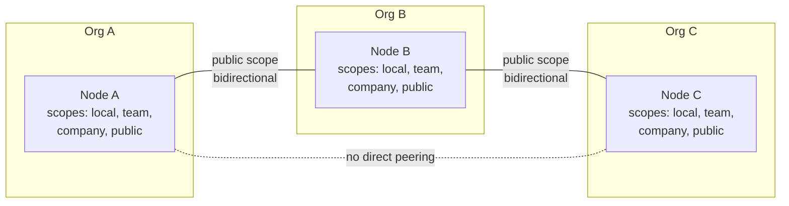
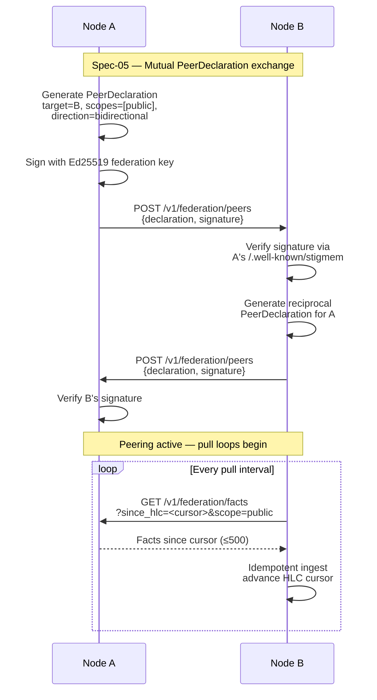
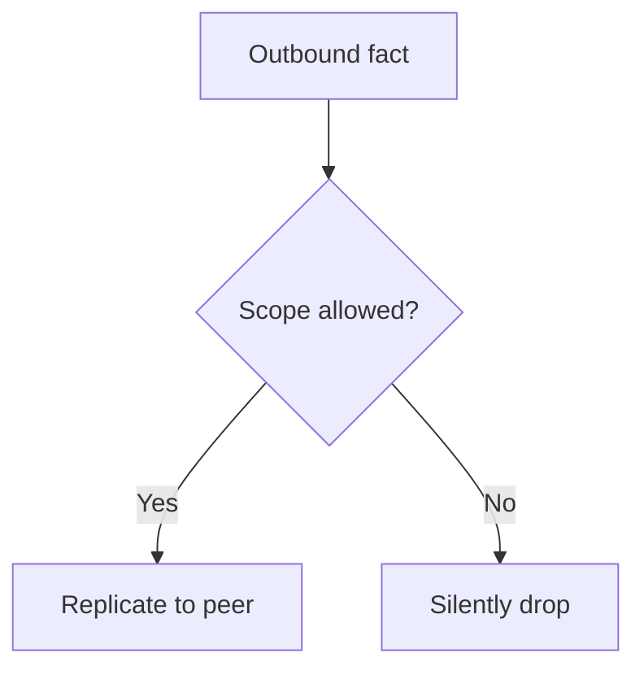

# Federated Network

2 min readFederation engineerSpec-05

**What this page covers**

Stigmem federation is pull-based: each node periodically fetches new
facts from registered peers using an HLC cursor. Peering is
established via mutual PeerDeclaration exchange, and replication
respects scope boundaries.

**Audience:** engineers implementing federation, deploying multi-node clusters, or reviewing `Spec-05-Federation-Trust`.

## Network topology

**Peering is pair-wise and explicit.**

Node A federates with Node B, and Node B federates with Node C, but
A and C have no direct peering. Facts flow A→B→C only if B's pull
from A and C's pull from B both cover the relevant scope.

## Handshake sequence

## Scope enforcement on federation

Nodes enforce scope on both sides:

<h4>Outbound</h4>
Facts whose scope exceeds the PeerDeclaration's <code>allowed_scopes</code> are silently dropped.

<h4>Inbound</h4>
Facts whose scope exceeds what the peer is authorized to write are rejected and logged to the federation audit table.

## Conflict on reunion

**When two nodes write divergent values during a partition, both facts survive.**

On reunion the receiving node detects the contradiction and creates
a conflict record (`Spec-15-Fact-Semantics`). Resolution is explicit
via `POST /v1/conflicts/:id/resolve`.

