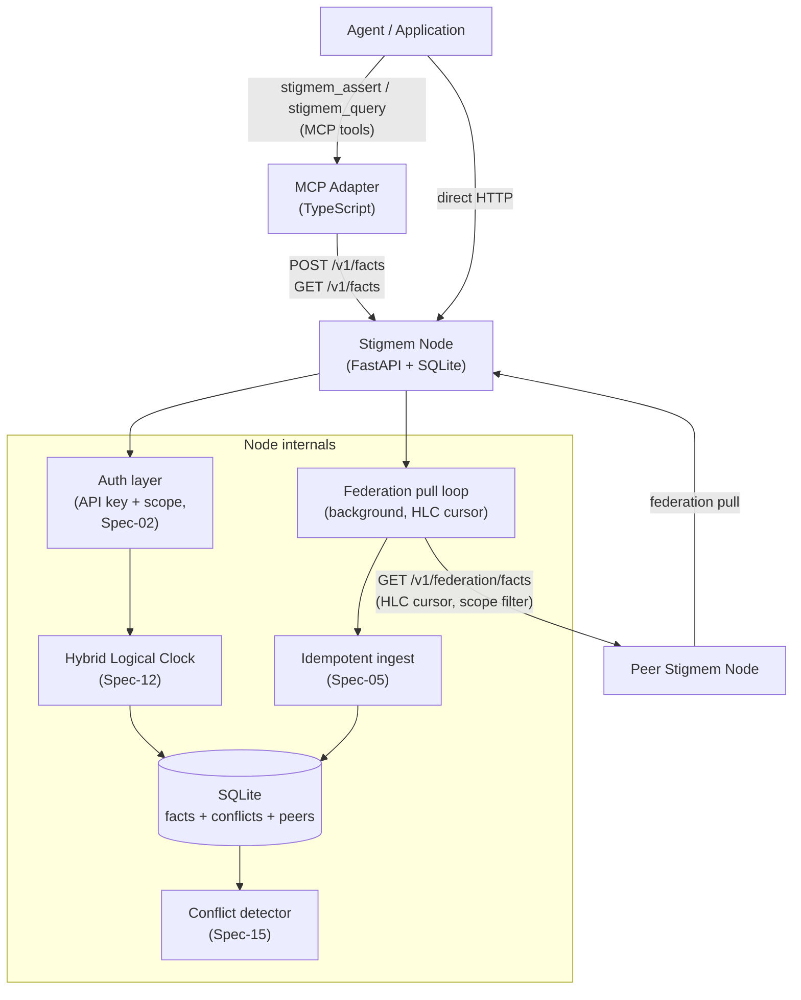
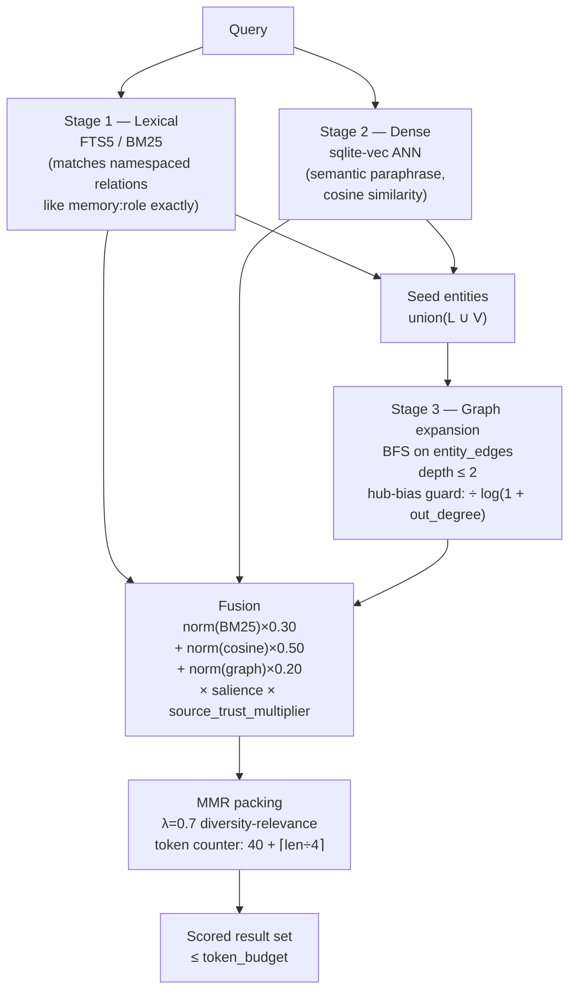

# Architecture

<p className="stigmem-meta"><span>10 min read</span><span>Node engineer · Spec reader</span><span>Reference</span></p>

<div className="stigmem-lead">

**What this page covers**

Engineer-facing architecture reference: the fact model, provenance,
decay, scope hierarchy, contradiction semantics, HLC, federation
protocol, auth model, repo map, and the experimental graph/recall
pipeline.

</div>

**Audience:** engineers contributing to the node, implementing an adapter, or reading the spec alongside the code.

## System overview

A Stigmem deployment is one or more **nodes** — self-contained FastAPI+SQLite processes — connected by the federation protocol. Clients assert and query facts via HTTP/JSON. Nodes peer with each other via a signed PeerDeclaration handshake and replicate facts across scope boundaries.



## The fact model

<div className="stigmem-keypoint">

**Every piece of knowledge is an atomic, immutable fact (`Spec-01-Fact-Model`).**

Facts are append-only: there is no `PUT` or `DELETE`. Updating a
value means asserting a new fact; the latest fact for a given
`(entity, relation, scope)` triple wins by precedence rules.

</div>

```
(entity, relation, value, source, timestamp, hlc, confidence, scope)
```

<div className="stigmem-fields">

<div>
<dt>Field</dt>
<dt><span className="stigmem-fields__type">Type</span></dt>
<dd>Why it exists</dd>
</div>

<div>
<dt><code>entity</code></dt>
<dt><span className="stigmem-fields__type">URI</span></dt>
<dd>What the fact is about. Entity-scoped, not agent-scoped — the same entity URI is shared across all agents and nodes.</dd>
</div>

<div>
<dt><code>relation</code></dt>
<dt><span className="stigmem-fields__type">namespaced string</span></dt>
<dd>What kind of statement this is. Namespaced to prevent collisions (<code>Spec-16-Namespace-Registry</code>).</dd>
</div>

<div>
<dt><code>value</code></dt>
<dt><span className="stigmem-fields__type">FactValue union</span></dt>
<dd>The asserted value: <code>string</code>, <code>text</code>, <code>number</code>, <code>boolean</code>, <code>datetime</code>, <code>ref</code>, <code>null</code>.</dd>
</div>

<div>
<dt><code>source</code></dt>
<dt><span className="stigmem-fields__type">URI</span></dt>
<dd>Who asserted the fact. Relayed facts carry the originating source, not the relay chain.</dd>
</div>

<div>
<dt><code>timestamp</code></dt>
<dt><span className="stigmem-fields__type">ISO 8601 UTC</span></dt>
<dd>Wall-clock write time, set by the node (clients may suggest).</dd>
</div>

<div>
<dt><code>hlc</code></dt>
<dt><span className="stigmem-fields__type">HLC string</span></dt>
<dd>Hybrid logical clock tick — causality-preserving across nodes. Required for federation ordering.</dd>
</div>

<div>
<dt><code>confidence</code></dt>
<dt><span className="stigmem-fields__type">float [0.0, 1.0]</span></dt>
<dd>Asserting party's certainty. <code>1.0</code> = certain, <code>0.0</code> = retracted.</dd>
</div>

<div>
<dt><code>scope</code></dt>
<dt><span className="stigmem-fields__type">local · team · company · public</span></dt>
<dd>Visibility and federation boundary. Enforced at read and write time.</dd>
</div>

</div>

## Provenance and decay

### Provenance

Every fact carries `source` and `timestamp`, stored without modification. Queries return the original `source`, never an intermediate relay. Federated facts additionally carry a `stigmem:received_from` meta-fact:

```json
{
  "entity":   "stigmem:fact:<uuid>",
  "relation": "stigmem:received_from",
  "value":    { "type": "ref", "v": "<originating-node-id>" },
  "source":   "system:stigmem"
}
```

This meta-fact is stored locally and never re-replicated.

### Decay

Facts have an optional expiry: `valid_until: ISO 8601 | null`.

<div className="stigmem-grid">

<div><h4>Hidden by default</h4><p>Expired facts are hidden from normal queries (as if they don't exist).</p></div>
<div><h4>Retained in store</h4><p>Queryable with <code>include_expired=true</code>.</p></div>
<div><h4>TTL via meta-fact</h4><p><code>(entity=&lt;fact-id&gt;, relation="stigmem:ttl", value=&lt;datetime&gt;)</code>.</p></div>

</div>

<div className="stigmem-keypoint">

**`valid_until` and `confidence` are orthogonal.**

A historical certain fact has `confidence=1.0` and `valid_until` set
to when it was superseded by a newer value.

</div>

## Scope hierarchy and enforcement (`Spec-02-Scopes-and-ACL`)

```
local   ─── node-only, never leaves this instance
team    ─── logical team boundary, node-operator-defined, never federated
company ─── owning company node; federated only when PeerDeclaration explicitly allows
public  ─── federatable to any registered peer by default
```

<div className="stigmem-fields">

<div>
<dt>Boundary</dt>
<dt><span className="stigmem-fields__type">Enforcement</span></dt>
<dd>Description</dd>
</div>

<div>
<dt>Write</dt>
<dt><span className="stigmem-fields__type">API-key scope</span></dt>
<dd>A client with <code>allowed_scopes: ["local"]</code> cannot write a <code>public</code>-scoped fact.</dd>
</div>

<div>
<dt>Read</dt>
<dt><span className="stigmem-fields__type">additive query</span></dt>
<dd>Cross-scope queries return results from all scopes the caller's key allows.</dd>
</div>

<div>
<dt>Federation</dt>
<dt><span className="stigmem-fields__type">PeerDeclaration</span></dt>
<dd>Nodes MUST reject outbound replication of facts whose scope exceeds what the active PeerDeclaration permits, and reject inbound facts beyond peer authority.</dd>
</div>

</div>

## Contradiction semantics (`Spec-15-Fact-Semantics`)

A contradiction exists when two facts share `(entity, relation, scope)` but have different values and both have `confidence > 0.0`.

<div className="stigmem-keypoint">

**Both facts are retained.**

The node auto-generates a `stigmem:conflict:<uuid>` reification with
`stigmem:conflict:between` and a `stigmem:conflict:status = "unresolved"`
companion fact.

</div>

**Resolution order at query time:**

<ol className="stigmem-steps">
<li>Higher <code>confidence</code> wins.</li>
<li>Equal confidence → higher <code>hlc</code> wins (causal ordering).</li>
<li>Tie → both returned with <code>contradicted: true</code>; caller decides.</li>
</ol>

Resolution is explicit and traceable: `POST /v1/conflicts/:id/resolve` writes a new fact with the resolved value, updating conflict status to `"resolved"` with full provenance.

## Hybrid Logical Clock (`Spec-12-HLC-Bounded-Skew`)

Every node maintains a single HLC: `HLC = "{wall_ms_utc}.{counter}"` (e.g. `"1746230400000.003"`).

**Advance rules:**

<ol className="stigmem-steps">
<li>On local write: <code>hlc = max(now_ms, last_hlc_ms)</code> as wall; increment counter if wall unchanged.</li>
<li>On receiving a federated fact: <code>hlc = max(now_ms, received_hlc_ms)</code>; increment counter.</li>
</ol>

<div className="stigmem-keypoint">

**The HLC prevents the split-brain scenario where two nodes partition, accept divergent writes, and then disagree about ordering on reunion.**

</div>

## Federation Protocol (`Spec-05-Federation-Trust`)

### Handshake

A **PeerDeclaration** is a signed JSON document declaring federation intent:

```json
{
  "declaring_node_id": "stigmem://node.alice.example",
  "target_node_id":    "stigmem://node.bob.example",
  "allowed_scopes":    ["public"],
  "direction":         "bidirectional",
  "signed_at":         "2026-05-01T00:00:00Z",
  "declaration_sig":   "<Ed25519 signature of canonical JSON of the above fields>"
}
```

Registration is mutual: both nodes must `POST /v1/federation/peers` with the declaration to activate the peering.

### Replication

Pull-based:

```
GET /v1/federation/facts?since_hlc=<last-seen>&scope=public&limit=500
Authorization: Bearer <peer-token>
```

<div className="stigmem-grid">

<div><h4>Short-lived peer tokens</h4><p>Ed25519-signed JWTs, max 1-hour expiry, nonce replay-protected.</p></div>
<div><h4>Idempotent ingest</h4><p>Re-asserting a fact that already exists is a no-op.</p></div>
<div><h4>HLC cursor resume</h4><p>Replication resumes exactly where it left off across restarts.</p></div>

</div>

### Failure modes

All four failure scenarios are automated in `node/tests/observability/test_failure_modes.py`:

<div className="stigmem-fields">

<div>
<dt>Scenario</dt>
<dt><span className="stigmem-fields__type">Outcome</span></dt>
<dd>Behavior</dd>
</div>

<div>
<dt>Split-brain</dt>
<dt><span className="stigmem-fields__type">no data loss</span></dt>
<dd>Both nodes accept writes during partition; contradictions surface on reunion.</dd>
</div>

<div>
<dt>Malicious peer</dt>
<dt><span className="stigmem-fields__type">rejected + audited</span></dt>
<dd>Facts in unauthorized scopes are rejected; audit log records the attempt.</dd>
</div>

<div>
<dt>Partial failure</dt>
<dt><span className="stigmem-fields__type">read/write available</span></dt>
<dd>Surviving node stays available; replication resumes from cursor on reconnect.</dd>
</div>

<div>
<dt>Replay attack</dt>
<dt><span className="stigmem-fields__type">nonce + window</span></dt>
<dd>Old signed messages are rejected via nonce + timestamp window.</dd>
</div>

</div>

## Auth model

<div className="stigmem-fields">

<div>
<dt>Credential</dt>
<dt><span className="stigmem-fields__type">Use</span></dt>
<dd>Properties</dd>
</div>

<div>
<dt>API keys (clients)</dt>
<dt><span className="stigmem-fields__type">client → node</span></dt>
<dd><code>Authorization: Bearer &lt;raw-key&gt;</code>. Node stores only SHA-256 hex digest. Maps to an <code>entity_uri</code>, permissions, and <code>allowed_scopes</code>.</dd>
</div>

<div>
<dt>Peer tokens (federation)</dt>
<dt><span className="stigmem-fields__type">node → node</span></dt>
<dd>Ed25519-signed JWTs, max 1-hour expiry. Public half published at <code>/.well-known/stigmem</code>. Nonce cache prevents replay.</dd>
</div>

</div>

Auth mode is advertised at `/.well-known/stigmem` as `"auth": "none" | "required"`. Single-operator deployments MAY set `STIGMEM_AUTH_REQUIRED=false`.

## Repo map

```
stigmem/
├── spec/                           ← canonical security evidence and generated spec mirrors
│   ├── security/                   ← threat model and evidence registry
│   └── specs/                      ← generated protocol spec snapshots
│
├── node/                           ← reference node (FastAPI + SQLite)
│   ├── src/stigmem_node/
│   │   ├── main.py                 ← FastAPI app factory, lifespan, router registration
│   │   ├── auth.py                 ← resolve_identity() dependency; API key validation
│   │   ├── db.py                   ← SQLite connection, schema migrations
│   │   ├── hlc.py                  ← node_hlc.tick() — global HLC (threading.Lock protected)
│   │   ├── federation_pull.py      ← background pull loop (HLC cursor, idempotent ingest)
│   │   ├── federation_ingest.py    ← idempotent fact ingestion; federation audit log
│   │   ├── peer_auth.py            ← PeerDeclaration verification, peer token generation
│   │   ├── peer_token.py           ← Ed25519 JWT sign/verify, nonce cache
│   │   └── routes/
│   │       ├── facts.py            ← POST/GET /v1/facts
│   │       ├── federation.py       ← /v1/federation/* facade
│   │       ├── conflicts.py        ← /v1/conflicts
│   │       └── wellknown.py        ← GET /.well-known/stigmem
│   ├── migrations/                 ← schema migrations
│   └── tests/                      ← reference-node unit, integration, conformance, security tests
│
├── adapters/                       ← platform adapters
├── packages/                       ← published Python packages and extracted plugins
├── sdks/                           ← SDKs and generated clients
├── experimental/                   ← deferred or gated features per ADR-002 / ADR-008
│
└── docs/                           ← Docusaurus 3 documentation site
```

## Key implementation notes

<div className="stigmem-grid">

<div><h4>SQLite as the v0.9.0a1 reference</h4><p>Schema is migration-friendly by design. PostgreSQL backend is feasible after the alpha line but not required.</p></div>
<div><h4>HLC requires a threading lock</h4><p>The in-process HLC state is shared between HTTP request path and background federation pull. Without <code>threading.Lock</code>, concurrent writes race.</p></div>
<div><h4>Idempotency + conflict edge case</h4><p>If fact F arrives twice via replication, the second ingestion is a no-op — it must not create a second conflict record.</p></div>
<div><h4><code>declaration_sig</code> excluded from preimage</h4><p>The Ed25519 signature covers all PeerDeclaration fields except <code>declaration_sig</code> itself.</p></div>

</div>

:::info Sequence diagrams coming
Federation handshake, conflict detection flow, and HLC tick protocol sequence diagrams are planned. Contributions welcome — see `CONTRIBUTING.md` at the repo root.
:::

## Graph index and recall pipeline (`Spec-X11-Recall-Graph`)

:::note pre-reset graph & recall design — draft
This section describes `Spec-X11-Recall-Graph`, which remains experimental. Security review of subscription auth and cross-garden recall scoping is in progress.
:::

pre-reset graph & recall design adds three interconnected subsystems: a **graph adjacency index**, a **vector embedding store**, and a **hybrid recall pipeline**.

### Graph adjacency index (`entity_edges`)

The facts table is flat. pre-reset adds a side-index that makes entity-to-entity traversal O(edges) rather than O(facts):

```sql
CREATE TABLE entity_edges (
    id           TEXT PRIMARY KEY,  -- = source fact id
    subject      TEXT NOT NULL,     -- "from" entity URI
    relation     TEXT NOT NULL,     -- edge label (predicate)
    object       TEXT NOT NULL,     -- "to" entity URI
    scope        TEXT NOT NULL,
    confidence   REAL NOT NULL,
    source_trust REAL,              -- cached per Spec-05-Federation-Trust
    created_at   INTEGER NOT NULL
);

CREATE INDEX idx_edges_subject ON entity_edges (subject, scope, confidence);
CREATE INDEX idx_edges_object  ON entity_edges (object,  scope, confidence);
```

`GET /v1/graph/neighbors` exposes bounded traversal over this index (depth ≤ 2 by default).

### Vector embedding store (`vec_facts`)

Each live fact (confidence > 0.1 by default) is embedded as the composed string `"{entity_display} {relation} {value_text}"` and stored in a `vec_facts` virtual table.

**Default model:** `nomic-embed-text-v1.5` — 768 dimensions, Apache-2.0, runs offline via `ollama pull nomic-embed-text`. Matryoshka architecture lets operators truncate to 256 dimensions via `STIGMEM_EMBED_DIMENSIONS`.

### Three-stage hybrid recall pipeline

`GET/POST /v1/recall` runs three retrieval stages independently, then fuses their candidate sets:



**Stage weights** default to `{lexical: 0.30, vector: 0.50, graph: 0.20}` and are caller-configurable.

**Salience signals:**

<div className="stigmem-fields">

<div>
<dt>Signal</dt>
<dt><span className="stigmem-fields__type">Range</span></dt>
<dd>Formula</dd>
</div>

<div>
<dt>Recency</dt>
<dt><span className="stigmem-fields__type">(0, 1]</span></dt>
<dd><code>exp(-0.01 × age_days)</code></dd>
</div>

<div>
<dt>Confidence</dt>
<dt><span className="stigmem-fields__type">[0, 1]</span></dt>
<dd><code>fact.confidence</code></dd>
</div>

<div>
<dt>Access frequency</dt>
<dt><span className="stigmem-fields__type">[0, 1]</span></dt>
<dd>log-normalized within candidate set.</dd>
</div>

<div>
<dt>Contradiction penalty</dt>
<dt><span className="stigmem-fields__type">&#123;0.7, 1.0&#125;</span></dt>
<dd>1.0 if no unresolved contradiction; 0.7 otherwise.</dd>
</div>

<div>
<dt>Garden tier</dt>
<dt><span className="stigmem-fields__type">[0, 1]</span></dt>
<dd>Configurable per garden; quarantine default 0.2.</dd>
</div>

<div>
<dt>Source-trust multiplier</dt>
<dt><span className="stigmem-fields__type">[0.5, 1]</span></dt>
<dd><code>0.5 + 0.5 × t</code>; 1.0 when trust off.</dd>
</div>

</div>

<div className="stigmem-keypoint">

**⚠ Security-critical — ANN scope filter (R1).**

`vec_facts` holds embeddings for **all** scopes and gardens with no
`scope` column. Stage 2 ANN results MUST be joined back against the
`facts` table and filtered by `scope = :scope` and the caller's
garden ACL before being passed to fusion or used as graph expansion
seeds. Without this filter, garden-B fact IDs surface in a garden-A
caller's response, leaking fact existence and content.

</div>

### Memory cards

A **memory card** is a per-entity synthesized summary stored as a `stigmem:memory:card` fact. It is the primary result for entity-centric recall queries.

<div className="stigmem-grid">

<div><h4>Surface contradictions</h4><p>Cards never silently pick a winner. <code>contradicted_count</code> non-zero signals partial unreliability.</p></div>
<div><h4>Refresh on assert</h4><p>New fact for the entity invalidates the card; enqueue background refresh.</p></div>
<div><h4>Refresh on decay</h4><p>Confidence change in a constituent fact invalidates the card.</p></div>
<div><h4>Age threshold</h4><p><code>STIGMEM_CARD_MAX_AGE_S</code> (default 86400s).</p></div>

</div>

During refresh the stale card remains readable with `card_stale: true`. Pass `force_refresh=true` to block on synchronous regeneration (bounded to 500ms).

<div className="stigmem-keypoint">

**Garden ACL on card recall (R2).**

When a recall query includes a memory card, the node MUST verify the
caller's garden ACL against the card's `garden_id` before including
it. Cards in unauthorized gardens MUST be excluded; the response
falls back to raw facts from authorized gardens only.

</div>

### Subscriptions

`POST /v1/subscriptions` registers a push subscription on a scope, entity, or garden. The node delivers events when matching facts change — eliminating polling loops for agents that watch shared entities.

<div className="stigmem-keypoint">

**Cross-garden leakage prevention.**

The node re-evaluates the caller's garden ACL **and** capability
token revocation status on every event delivery. Event content is
not populated until the ACL check passes. If access has been revoked
since subscription creation, delivery is silently dropped and the
subscription is cancelled with event type
`subscription_cancelled_access_revoked`. Implementations MUST NOT
optimize this check away (e.g., by caching the result from
subscription creation time).

</div>

Events are buffered for `STIGMEM_SUBSCRIPTION_REPLAY_S` seconds (default 3600s). Subscribers may request replay via `GET /v1/subscriptions/:id/events?after={event_id}` within this window.
