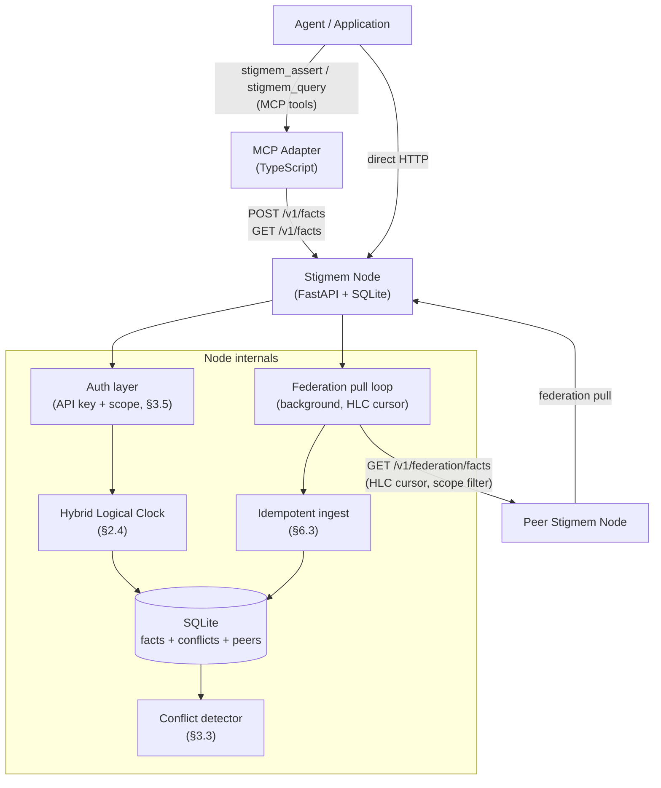
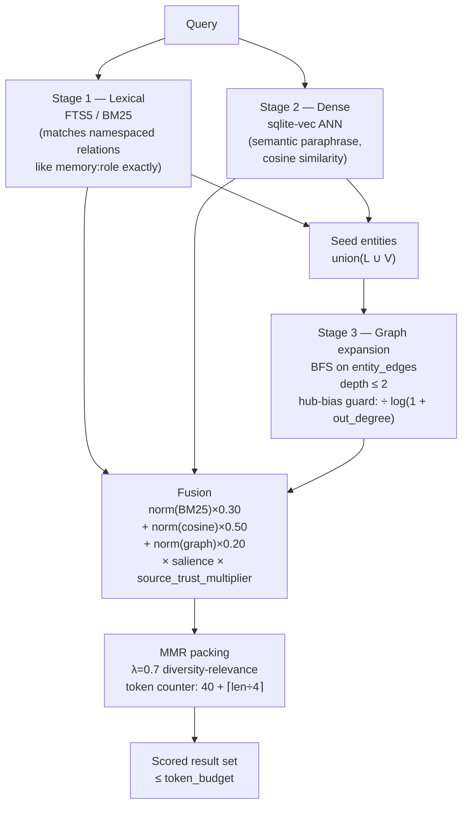

# Architecture

*Audience: engineers contributing to the node, implementing an adapter, or reading the spec alongside the code.*

---

## System overview

A Stigmem deployment is one or more **nodes** — self-contained FastAPI+SQLite processes — connected by the federation protocol. Clients assert and query facts via HTTP/JSON. Nodes peer with each other via a signed PeerDeclaration handshake and replicate facts across scope boundaries.



---

## The fact model

Every piece of knowledge is an **atomic, immutable fact** (spec §2):

```
(entity, relation, value, source, timestamp, hlc, confidence, scope)
```

| Field | Type | Why it exists |
|-------|------|---------------|
| `entity` | URI (`stigmem://…` formal; informal deprecated in pre-reset) | *What* the fact is about. Entity-scoped, not agent-scoped — the same entity URI is shared across all agents and nodes. |
| `relation` | namespaced string (`memory:role`, `roadmap:status`, …) | *What kind* of statement this is. Namespaced to prevent collisions (spec §9 namespace registry). |
| `value` | `FactValue` union | The asserted value. See §2.1 for the full type lattice: `string`, `text`, `number`, `boolean`, `datetime`, `ref`, `null`. |
| `source` | URI | *Who* asserted the fact. Stored immutably; relayed facts carry the *originating* source, not the relay chain. |
| `timestamp` | ISO 8601 UTC | Wall-clock write time, set by the node (clients may suggest). |
| `hlc` | HLC string (`{wall_ms}.{counter}`) | Hybrid logical clock tick — causality-preserving across nodes. Required for federation ordering (§2.4). |
| `confidence` | float `[0.0, 1.0]` | Asserting party's certainty. `1.0` = certain, `0.0` = retracted. Used in contradiction resolution. |
| `scope` | `local \| team \| company \| public` | Visibility and federation boundary. Enforced at read and write time. |

Facts are **append-only**: there is no `PUT` or `DELETE`. Updating a value means asserting a new fact; the latest fact for a given `(entity, relation, scope)` triple wins by precedence rules.

---

## Provenance and decay

### Provenance (§3.1)

Every fact carries `source` and `timestamp`, stored without modification. Queries return the original `source`, never an intermediate relay. Federated facts additionally carry a `stigmem:received_from` meta-fact (generated automatically by the receiving node):

```json
{
  "entity":   "stigmem:fact:<uuid>",
  "relation": "stigmem:received_from",
  "value":    { "type": "ref", "v": "<originating-node-id>" },
  "source":   "system:stigmem"
}
```

This meta-fact is stored locally and never re-replicated.

### Decay (`valid_until`, §3.2)

Facts have an optional expiry: `valid_until: ISO 8601 | null`. Expired facts:
- Are **hidden** from normal queries (as if they don't exist).
- Are **retained** in the store (queryable with `include_expired=true`).
- Can also be set via a TTL meta-fact: `(entity=<fact-id>, relation="stigmem:ttl", value=<datetime>)`.

`valid_until` and `confidence` are **orthogonal**: a historical certain fact has `confidence=1.0` and `valid_until` set to when it was superseded by a newer value.

---

## Scope hierarchy and enforcement (§2.2, §3.4)

```
local   ─── node-only, never leaves this instance
team    ─── logical team boundary, node-operator-defined, never federated
company ─── owning company node; federated only when PeerDeclaration explicitly allows
public  ─── federatable to any registered peer by default
```

**Write-time enforcement:** A client presenting an API key with `allowed_scopes: ["local"]` cannot write a `public`-scoped fact.

**Read-time enforcement:** Cross-scope queries are additive — a query with no scope filter returns results from all scopes the caller's key allows.

**Federation enforcement:** Nodes MUST reject outbound replication of facts whose scope exceeds what the active PeerDeclaration permits. Nodes MUST reject inbound facts whose scope exceeds what the peer is authorized to write.

---

## Contradiction semantics (§3.3)

A contradiction exists when two facts share `(entity, relation, scope)` but have different values and both have `confidence > 0.0`. **Both facts are retained.** The node auto-generates:

```json
{
  "entity":   "stigmem:conflict:<uuid>",
  "relation": "stigmem:conflict:between",
  "value":    { "type": "text", "v": "<fact-id-a> <fact-id-b>" },
  "source":   "system:stigmem",
  "confidence": 1.0,
  "scope":    "<same as conflicting facts>"
}
```

Plus a `stigmem:conflict:status = "unresolved"` companion fact.

**Resolution order at query time:**
1. Higher `confidence` wins.
2. Equal confidence → higher `hlc` wins (causal ordering via §2.4).
3. Tie → both returned with `contradicted: true`; caller decides.

Resolution is explicit and traceable: `POST /v1/conflicts/:id/resolve` writes a new fact with the resolved value, updating conflict status to `"resolved"` with full provenance.

---

## Hybrid Logical Clock (§2.4)

Every node maintains a single HLC:

```
HLC = "{wall_ms_utc}.{counter}"    // e.g. "1746230400000.003"
```

**Advance rules:**
1. On local write: `hlc = max(now_ms, last_hlc_ms)` as wall; increment counter if wall unchanged.
2. On receiving a federated fact: `hlc = max(now_ms, received_hlc_ms)`; increment counter.

Causally ordered facts (`a.hlc < b.hlc`) are handled correctly across nodes. Equal HLCs on different nodes indicate concurrent writes; §3.3 contradiction policy applies. The HLC prevents the split-brain scenario where two nodes partition, accept divergent writes, and then disagree about ordering on reunion.

---

## Federation protocol (§6)

### Handshake (§6.1–6.2)

A **PeerDeclaration** is a signed JSON document declaring federation intent:

```json
{
  "declaring_node_id": "stigmem://node.alice.example",
  "target_node_id":    "stigmem://node.bob.example",
  "allowed_scopes":    ["public"],
  "direction":         "bidirectional",
  "signed_at":         "2026-05-01T00:00:00Z",
  "declaration_sig":   "<Ed25519 signature of canonical JSON of the above fields>"
}
```

The signature uses the declaring node's `federation_pubkey`, published at `/.well-known/stigmem`. Registration is mutual: both nodes must `POST /v1/federation/peers` with the declaration to activate the peering. Capability negotiation (§6.2) is required as of pre-reset.

### Replication (§6.3)

Pull-based: each node's background `federation_pull` task runs periodically, fetching facts from registered peers:

```
GET /v1/federation/facts?since_hlc=<last-seen>&scope=public&limit=500
Authorization: Bearer <peer-token>
```

Peer tokens are short-lived Ed25519-signed JWTs (max 1-hour expiry, replay-protected by nonce). Fact ingestion is **idempotent**: re-asserting a fact that already exists is a no-op. The HLC cursor ensures replication resumes exactly where it left off across restarts.

### Failure modes (§11)

All four failure scenarios are automated in `node/tests/test_failure_modes.py`:

| Scenario | Behavior |
|----------|----------|
| Split-brain | Both nodes accept writes during partition; contradictions surface on reunion; no data loss |
| Malicious peer | Facts asserted in unauthorized scopes are rejected; audit log records the attempt |
| Partial failure | Surviving node stays read/write available; replication resumes from cursor on reconnect |
| Replay attack | Old signed messages are rejected via nonce + timestamp window |

---

## Auth model (§3.5)

the pre-reset design work implemented API-key auth; the pre-reset design work extended it with peer tokens for federation.

**API keys (clients):**
- Presented as `Authorization: Bearer <raw-key>`.
- Node stores only the SHA-256 hex digest; the raw key is never retained.
- Each key maps to an `entity_uri`, a set of permissions (`read`, `write`, `federate`), and `allowed_scopes`.

**Peer tokens (federation):**
- Ed25519-signed JWTs, max 1-hour expiry.
- Signing keypair is separate from API keys; public half published at `/.well-known/stigmem`.
- Nonce cache prevents replay.

Auth mode is advertised at `/.well-known/stigmem` as `"auth": "none" | "required"`. Single-operator deployments MAY set `STIGMEM_AUTH_REQUIRED=false` (the default); all callers are trusted in that mode.

---

## Repo map

```
stigmem/
├── spec/                           ← canonical spec (pre-reset → pre-reset-draft)
│   └── README.md                   ← spec status table
│
├── node/                           ← reference node (FastAPI + SQLite)
│   ├── stigmem_node/
│   │   ├── main.py                 ← FastAPI app factory, lifespan, router registration
│   │   ├── auth.py                 ← resolve_identity() dependency; API key validation
│   │   ├── db.py                   ← SQLite connection, schema migrations
│   │   ├── hlc.py                  ← node_hlc.tick() — global HLC (threading.Lock protected)
│   │   ├── federation_pull.py      ← background pull loop (HLC cursor, idempotent ingest)
│   │   ├── federation_ingest.py    ← idempotent fact ingestion; federation audit log
│   │   ├── peer_auth.py            ← PeerDeclaration verification, peer token generation
│   │   ├── peer_token.py           ← Ed25519 JWT sign/verify, nonce cache
│   │   └── routes/
│   │       ├── facts.py            ← POST/GET /v1/facts, conflict detection
│   │       ├── federation.py       ← /v1/federation/* , /v1/conflicts
│   │       └── wellknown.py        ← GET /.well-known/stigmem
│   ├── migrations/
│   │   ├── 001_init.sql            ← facts table
│   │   └── 002_federation.sql      ← peers, conflicts, audit tables
│   └── tests/                      ← 74 passing tests
│       ├── test_facts.py           ← fact CRUD, contradiction, scope enforcement
│       ├── test_federation.py      ← handshake, pull replication, scope leak attempts
│       └── test_failure_modes.py   ← §11 acceptance tests: split-brain, malicious peer, partial failure, replay
│
├── adapters/                       ← platform adapters (the pre-reset design work, in flight)
│   ├── mcp/                        ← MCP server (TypeScript): stigmem_assert + stigmem_query tools
│   ├── openclaw/                   ← Claude Code / OpenClaw adapter (Python): PARA→fact mapping
│   └── paperclip/                  ← Paperclip hook adapter (JS): emits lifecycle events as facts
│
├── dogfood/                        ← CEO memory migration scripts
│   ├── migrate_ceo_memory.py       ← PARA memory → Stigmem fact migration
│   └── snapshot.sh                 ← snapshot current node state
│
└── docs/                           ← Docusaurus 3 documentation site
    └── docs/                       ← content
        ├── learn/                  ← concepts, features, quickstart
        ├── build/                  ← guides, connectors, SDKs, tutorials
        ├── operate/                ← backends, deployment, runbooks, security, observability
        ├── reference/              ← spec, API, architecture, CLI, glossary
        └── community/              ← project resources, contributing
```

---

## Key implementation notes

**SQLite as the pre-reset design work–4 storage.** The schema (spec §10) is migration-friendly by design: column additions do not require table rewrites. A PostgreSQL backend is feasible for the pre-reset design work+ but not required before v1.0.

**HLC requires a threading lock.** The in-process HLC state is shared between the HTTP request path and the background federation pull task. Without `threading.Lock`, concurrent writes race and may produce out-of-order HLC values. Fixed in `hlc.py`; noted in the pre-reset design work exit memo.

**Idempotency + conflict edge case.** If fact F arrives from peer A and creates a conflict with local fact G, then F arrives again via replication, the second ingestion is a no-op — it must not create a second conflict record. `federation_ingest.py` handles this; the spec §6.3 needs a normative sentence covering this case before pre-reset.1 is finalized.

**`declaration_sig` excluded from its own preimage.** The Ed25519 signature over a PeerDeclaration covers all fields *except* `declaration_sig` itself (which obviously does not exist at signing time). The spec §6.1 now enumerates excluded fields explicitly; `peer_auth.py` implements accordingly.

:::info Sequence diagrams coming
Federation handshake, conflict detection flow, and HLC tick protocol sequence diagrams are planned. Contributions welcome — see `CONTRIBUTING.md` at the repo root for the RFC process.
:::

---

## Graph index and recall pipeline (§20 — draft)

:::note pre-reset graph & recall design — draft
This section describes spec §20, which is currently a draft. The architecture is normative in `spec/stigmem-spec-pre-reset draft.md`; security review of subscription auth and cross-garden recall scoping is in progress. The diagram and formulas below reflect the draft spec and may change before §20 is promoted to normative.
:::

*Audience: engineers building recall-capable agents, implementing the reference node, or contributing to §20.*

pre-reset graph & recall design adds three interconnected subsystems to the reference node: a **graph adjacency index**, a **vector embedding store**, and a **hybrid recall pipeline**. Together they let agents retrieve semantically relevant facts by query rather than exact predicate, within a caller-specified token budget.

---

### Graph adjacency index (`entity_edges`)

The facts table is flat: facts are rows with no materialized connections between entities. pre-reset graph & recall design adds a side-index that makes entity-to-entity traversal O(edges) rather than O(facts):

```sql
CREATE TABLE entity_edges (
    id           TEXT PRIMARY KEY,  -- = source fact id
    subject      TEXT NOT NULL,     -- "from" entity URI
    relation     TEXT NOT NULL,     -- edge label (predicate)
    object       TEXT NOT NULL,     -- "to" entity URI
    scope        TEXT NOT NULL,
    confidence   REAL NOT NULL,
    source_trust REAL,              -- cached per §19.4.4
    created_at   INTEGER NOT NULL
);

CREATE INDEX idx_edges_subject ON entity_edges (subject, scope, confidence);
CREATE INDEX idx_edges_object  ON entity_edges (object,  scope, confidence);
```

A row is inserted whenever a fact with `value.type = "ref"` is persisted and the ref target passes entity-URI validation. The row is soft-deleted (confidence set to 0.0) when the source fact is retracted — hard deletion is a maintenance-only operation. The decay sweeper keeps `entity_edges.confidence` in sync with its source fact within the same transaction.

`GET /v1/graph/neighbors` exposes bounded traversal over this index (depth ≤ 2 by default; capped at 2 to prevent hub-bias collapse on high-degree entities). Cross-garden traversal is governed by the caller's garden ACL, checked at the application layer.

---

### Vector embedding store (`vec_facts`)

Each live fact (confidence > 0.1 by default) is embedded as the composed string:

```
"{entity_display} {relation} {value_text}"
```

and stored in a `vec_facts` virtual table (sqlite-vec for SQLite/libSQL; pgvector column for Postgres). Embeddings are L2-normalized at insertion so cosine similarity reduces to a dot product, enabling sqlite-vec's native acceleration.

**Default model:** `nomic-embed-text-v1.5` — 768 dimensions, Apache-2.0 license, runs offline via `ollama pull nomic-embed-text`. The Matryoshka architecture lets operators truncate to 256 dimensions via `STIGMEM_EMBED_DIMENSIONS` without re-training, for resource-constrained deployments.

When a fact's confidence falls below the tombstone threshold, its vector is deleted from `vec_facts` in the same transaction. Contradicted facts retain their vectors; a penalty is applied at ranking time, not by modifying the stored embedding.

---

### Three-stage hybrid recall pipeline

`GET/POST /v1/recall` runs three retrieval stages independently, then fuses their candidate sets:



**Stage weights** default to `{lexical: 0.30, vector: 0.50, graph: 0.20}` and are caller-configurable. Dense retrieval dominates because embeddings capture semantic paraphrase that BM25 misses for natural-language queries; lexical is kept to preserve exact relation-namespace matching.

**Salience signals** applied in the fusion formula:

| Signal | Formula | Range |
|--------|---------|-------|
| Recency | `exp(-0.01 × age_days)` | (0, 1] |
| Confidence | `fact.confidence` | [0, 1] |
| Access frequency | `log(1 + access_count) / log(1 + max_access_count)` | [0, 1] |
| Contradiction penalty | 1.0 if no unresolved contradiction; 0.7 otherwise | {0.7, 1.0} |
| Garden tier | configurable per garden; quarantine default 0.2 | [0, 1] |
| Source-trust multiplier | `0.5 + 0.5 × t` (maps [0,1] → [0.5,1.0]); 1.0 when trust off | [0.5, 1] |

**⚠ Security-critical — ANN scope filter (R1):** `vec_facts` holds embeddings for **all** scopes and gardens with no `scope` column. Stage 2 ANN results MUST be joined back against the `facts` table and filtered by `scope = :scope` and the caller's garden ACL before being passed to fusion or used as graph expansion seeds. Without this filter, garden-B fact IDs surface in a garden-A caller's response, leaking fact existence and content.

**Token-budget packing (MMR):** greedy-by-score selection is avoided because multiple facts about the same entity with the same relation are frequently near-duplicate. Maximal Marginal Relevance iteratively selects the next highest-scoring candidate whose embedding is most different from what has already been selected. `λ_mmr = 0.7` balances relevance and diversity; `λ_mmr = 1.0` degrades to greedy. Token cost is estimated as 40 (fixed overhead) plus `⌈char_count / 4⌉` for the value text.

---

### Memory cards

A **memory card** is a per-entity synthesized summary stored as a `stigmem:memory:card` fact. It is the primary result for entity-centric recall queries (`entity=` specified), providing a pre-aggregated view that avoids re-ranking all constituent facts on every call.

Cards are structured Markdown:

```markdown
## {entity_display_name}

**Type:** {entity_type}  **URI:** {entity_uri}  **Last refreshed:** {iso8601}

### Current facts ({n} live, {m} contradicted)

| Relation | Value | Confidence | Source | Since |
|----------|-------|------------|--------|-------|
| memory:role | CTO | 1.00 | agent/assistant | 2026-04-01 |

### Contradictions ({m} unresolved)

- **memory:role**: `CEO` (conf 1.00) ⟷ `CTO` (conf 0.80) — *unresolved*
```

Cards surface contradictions explicitly — they do not silently pick a winner. The `contradicted_count` metadata field is non-zero when any contradiction exists, signaling to the consumer that the summary is partially unreliable.

**Refresh triggers:**
1. New fact asserted for the entity
2. Decay sweep touches a constituent fact (confidence change)
3. Card age exceeds `STIGMEM_CARD_MAX_AGE_S` (default 86400s)

During refresh the stale card remains readable with `card_stale: true`. Pass `force_refresh=true` to block on synchronous regeneration (bounded to 500ms; falls back to raw facts if exceeded). Card facts are exempt from the decay sweeper.

**Garden ACL on card recall (R2):** when a recall query includes a memory card in the response, the node MUST verify the caller's garden ACL against the card's `garden_id` before including it. Cards in unauthorized gardens MUST be excluded; the response falls back to raw facts from authorized gardens only. An entity may have multiple cards scoped to different gardens; only accessible cards are returned.

---

### Subscriptions

`POST /v1/subscriptions` registers a push subscription on a scope, entity, or garden. The node delivers events when matching facts change — eliminating polling loops for agents that watch shared entities.

Subscription creation requires a capability token (§19.3, validated per §19.3.3) covering the `subscribe` verb on the target (§19.3.2). The node re-evaluates the caller's garden ACL **and** capability token revocation status (§19.3.4) on every event delivery. Event content is not populated until the ACL check passes — the event record may be queued internally, but the content must not be populated before authorization. If access has been revoked since subscription creation, delivery is silently dropped and the subscription is cancelled with event type `subscription_cancelled_access_revoked`.

Events are buffered for `STIGMEM_SUBSCRIPTION_REPLAY_S` seconds (default 3600s). Subscribers may request replay via `GET /v1/subscriptions/:id/events?after={event_id}` within this window.

**Cross-garden leakage prevention:** the garden ACL check on each delivery is the primary guard against cross-garden fact leakage via standing event streams. Implementations MUST NOT optimize this away (e.g., by caching the result from subscription creation time).
