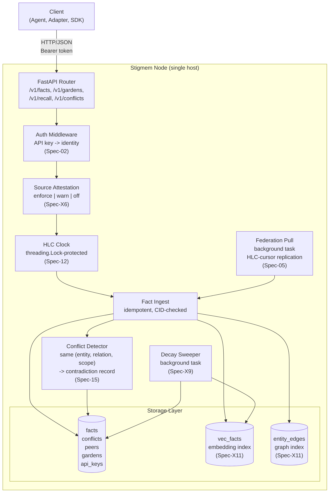

# Single-Host Node

2 min readEngineerReference architecture

**What this page covers**

A single Stigmem node is a self-contained FastAPI process backed by
SQLite (or libSQL/Postgres). This diagram shows the internal
component layout and request flow.

**Audience:** engineers deploying or contributing to the Stigmem reference node.

## Key components

<dt>Component</dt>
<dt>File</dt>
<dd>Responsibility</dd>

<dt>FastAPI Router</dt>
<dt><code>main.py</code>, <code>routes/</code></dt>
<dd>HTTP endpoint registration, lifespan management.</dd>

<dt>Auth Middleware</dt>
<dt><code>auth.py</code></dt>
<dd>Resolves <code>Authorization: Bearer</code> to an identity with scopes and permissions.</dd>

<dt>Source Attestation</dt>
<dt><code>auth.py</code></dt>
<dd>Validates <code>source</code> URI against caller's <code>entity_uri</code> (<code>Spec-X6</code>).</dd>

<dt>HLC Clock</dt>
<dt><code>hlc.py</code></dt>
<dd>Thread-safe hybrid logical clock; advances on local writes and federated receives.</dd>

<dt>Fact Ingest</dt>
<dt><code>routes/facts.py</code></dt>
<dd>Idempotent fact insertion, CID computation, scope enforcement.</dd>

<dt>Conflict Detector</dt>
<dt><code>routes/facts.py</code></dt>
<dd>Detects <code>(entity, relation, scope)</code> value divergence; creates contradiction records.</dd>

<dt>Decay Sweeper</dt>
<dt><code>decay.py</code></dt>
<dd>Background task that expires facts past <code>valid_until</code> or low confidence.</dd>

<dt>Federation Pull</dt>
<dt><code>federation_pull.py</code></dt>
<dd>Periodically fetches new facts from registered peers using HLC cursor.</dd>

<dt>Storage</dt>
<dt><code>db.py</code></dt>
<dd>SQLite/libSQL/Postgres with migration support; <code>vec_facts</code> and <code>entity_edges</code> for recall.</dd>

