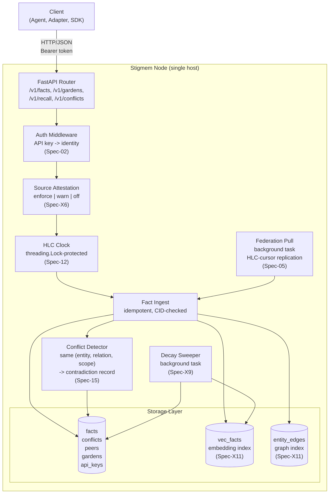

# Single-Host Node

*Audience: engineers deploying or contributing to the Stigmem reference node.*

A single Stigmem node is a self-contained FastAPI process backed by SQLite (or libSQL/Postgres). This diagram shows the internal component layout and request flow.

## Key components

| Component | File | Responsibility |
|-----------|------|---------------|
| FastAPI Router | `main.py`, `routes/` | HTTP endpoint registration, lifespan management |
| Auth Middleware | `auth.py` | Resolves `Authorization: Bearer` to an identity with scopes and permissions |
| Source Attestation | `auth.py` | Validates `source` URI against caller's `entity_uri` (`Spec-X6-Source-Attestation`) |
| HLC Clock | `hlc.py` | Thread-safe hybrid logical clock; advances on local writes and federated receives |
| Fact Ingest | `routes/facts.py` | Idempotent fact insertion, CID computation, scope enforcement |
| Conflict Detector | `routes/facts.py` | Detects `(entity, relation, scope)` value divergence; creates contradiction records |
| Decay Sweeper | `decay.py` | Background task that expires facts past `valid_until` or low confidence (`Spec-X9-Decay-Semantics`) |
| Federation Pull | `federation_pull.py` | Periodically fetches new facts from registered peers using HLC cursor (`Spec-05-Federation-Trust`) |
| Storage | `db.py` | SQLite/libSQL/Postgres with migration support; `vec_facts` and `entity_edges` for recall |
