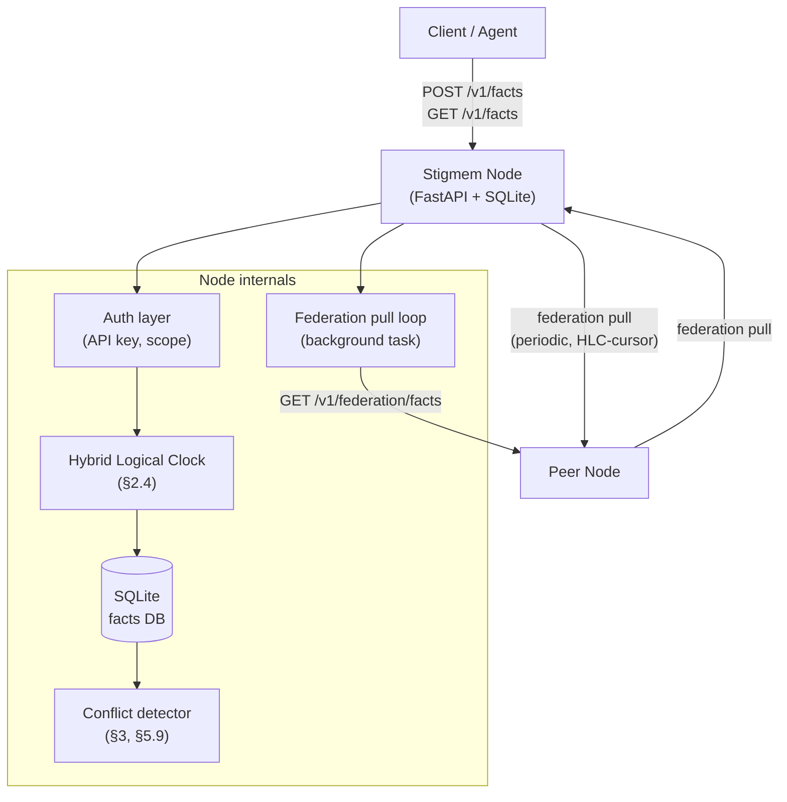

# Architecture

## System overview

The Stigmem reference node is a single-process FastAPI application backed by SQLite. Nodes can form a peer mesh via the federation protocol.



## Key components

| Component | File | Role |
|-----------|------|------|
| FastAPI app | `main.py` | App factory, lifespan manager, router registration |
| Auth layer | `auth.py` | `resolve_identity()` dependency; API key validation |
| SQLite + migrations | `db.py` | Persistent fact storage, migration runner |
| Hybrid Logical Clock | `hlc.py` | `node_hlc.tick()` — global ordering across nodes (§2.4) |
| Conflict detector | `routes/facts.py` | Detects contradictory facts at write time; creates ConflictRecord |
| Federation pull loop | `federation_pull.py` | Background task pulling facts from registered peers |
| Fact ingestion | `federation_ingest.py` | Idempotent fact ingestion; federation audit logging |
| Peer auth | `peer_auth.py`, `peer_token.py` | Ed25519 token generation, verification, nonce cache (§6.3) |

## Routes

| Router | Module | Endpoints |
|--------|--------|-----------|
| Facts | `routes/facts.py` | `POST /v1/facts`, `GET /v1/facts`, `GET /v1/facts/{id}` |
| Federation | `routes/federation.py` | `/v1/federation/*`, `/v1/conflicts` |
| Well-known | `routes/wellknown.py` | `GET /.well-known/stigmem` |

## Data model

The SQLite schema (spec §10) stores facts in a single `facts` table:

```sql
CREATE TABLE facts (
    id          TEXT PRIMARY KEY,      -- UUID
    entity      TEXT NOT NULL,
    relation    TEXT NOT NULL,
    value_json  TEXT NOT NULL,         -- JSON-encoded FactValue
    source      TEXT NOT NULL,
    confidence  REAL NOT NULL,
    scope       TEXT NOT NULL,
    hlc         TEXT NOT NULL,         -- e.g. "1746230400000-0001-a3f2"
    timestamp   TEXT NOT NULL,         -- ISO 8601 UTC
    valid_until TEXT                   -- ISO 8601 UTC or NULL
);
```

Conflicts are stored as meta-facts with relation `stigmem:conflict:between` and additionally tracked in a `conflicts` table for efficient listing and resolution.

:::info Coming soon
Sequence diagrams for the federation handshake, conflict detection flow, and HLC tick protocol are planned for the next docs sprint.
:::
